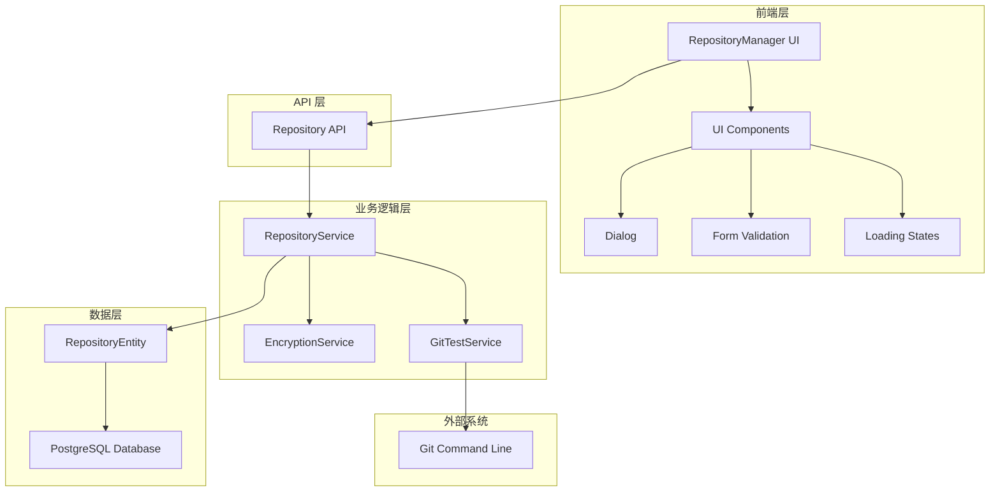

# Repository Management - Design

## Overview

仓库管理功能是一个完整的全栈解决方案，包含前端 React 组件、后端 NestJS 服务、数据库实体和 API 接口。该功能基于现有的架构模式，复用现有组件和服务，同时增强用户界面和功能体验。

## Steering Document Alignment

### Technical Standards (tech.md)
设计遵循项目的技术标准：
- **后端**: NestJS + TypeORM + PostgreSQL 架构
- **前端**: React + TypeScript + TailwindCSS
- **认证**: JWT + Guards 机制
- **数据加密**: AES-256-CBC 算法
- **API 设计**: RESTful 风格

### Project Structure (structure.md)
实现将遵循项目组织约定：
- **实体**: `packages/server/src/entities/`
- **服务**: `packages/server/src/services/`
- **控制器**: `packages/server/src/controllers/`
- **组件**: `packages/web/src/components/repository/`
- **存储**: `packages/web/src/store/`

## Code Reuse Analysis

### Existing Components to Leverage
- **RepositoryEntity**: 现有数据模型 (packages/server/src/entities/repository.entity.ts)
- **RepositoryService**: 基础服务逻辑 (packages/server/src/services/repository.service.ts)
- **RepositoryController**: 现有 API 端点 (packages/server/src/controllers/repository.controller.ts)
- **RepositoryManager**: 前端组件基础 (packages/web/src/components/repository/RepositoryManager.tsx)
- **UI 组件库**: Dialog, Button, Input 等 (packages/web/src/components/ui/)

### Integration Points
- **认证系统**: 使用现有的 JWT Guards 和 useAuthStore
- **数据库**: 复用现有 TypeORM 配置和连接
- **WebSocket**: 集成现有 ChatGateway 用于实时状态更新
- **加密服务**: 扩展现有的认证加密机制

## Architecture



## Requirements Traceability

### Requirement 1 (CRUD Operations) → Design Solutions
- **RepositoryManager Component**: 提供完整的创建、读取、更新、删除界面
- **Enhanced Dialog Component**: 解决表单显示和交互问题
- **Repository API Extensions**: 提供完整的 RESTful CRUD 端点

### Requirement 2 (Authentication) → Design Solutions
- **Credential Parser**: 解析不同平台的认证格式
- **Encryption Service**: 使用随机 IV 的安全加密存储
- **Dynamic Form Validation**: 根据仓库类型动态显示认证字段

### Requirement 3 (Connection Testing) → Design Solutions
- **Connection Test Engine**: 实现重试机制和详细错误报告
- **Retry Strategy**: 指数退避重试，最多 3 次
- **Real-time Feedback**: 显示测试进度和加载状态

### Requirement 4 (Branch Selection) → Design Solutions
- **Branch Discovery Service**: 自动获取和解析分支列表
- **Smart Default Selection**: 优先选择 main > master > 第一个可用分支
- **Branch Validation**: 验证用户指定分支的存在性

### Requirement 5 (React Repository Testing) → Design Solutions
- **Public Repository Support**: 特殊处理无认证的公共仓库
- **Large Repository Optimization**: 针对大型仓库的超时和性能优化
- **Test Case Integration**: 内置 React 仓库作为测试用例

### Requirement 6 (Dialog UI Improvement) → Design Solutions
- **Modern Dialog Component**: 半透明背景、圆角边框、阴影效果
- **Responsive Design**: 适配不同屏幕尺寸的弹窗布局
- **Smooth Animations**: CSS 过渡动画和加载状态

## Components and Interfaces

### Component 1: Enhanced RepositoryManager
- **Purpose:** 提供现代化的仓库管理界面
- **Interfaces:** 
  - `loadRepositories()`: 加载仓库列表
  - `handleSubmit()`: 处理表单提交
  - `handleTestConnection()`: 测试仓库连接
  - `handleDelete()`: 删除仓库
- **Dependencies:** useAuthStore, API_BASE_URL, UI 组件
- **Reuses:** 现有 RepositoryManager 组件作为基础，增强对话框界面

### Component 2: Enhanced Dialog Component
- **Purpose:** 提供改进的对话框用户体验
- **Interfaces:**
  - `onOpen()`: 打开对话框
  - `onClose()`: 关闭对话框
  - `renderContent()`: 渲染内容
- **Dependencies:** React Portal, TailwindCSS 动画
- **Reuses:** 集成现有 UI 组件库的 Dialog 基础组件

### Component 3: Enhanced RepositoryService
- **Purpose:** 扩展仓库业务逻辑和测试功能
- **Interfaces:**
  - `testConnectionWithRetry()`: 带重试的连接测试
  - `validateCredentials()`: 验证认证信息
  - `getBranchList()`: 获取分支列表
  - `logOperation()`: 记录操作日志
- **Dependencies:** TypeORM, crypto, child_process
- **Reuses:** 扩展现有 RepositoryService，增加重试和日志功能

### Component 4: Connection Test Engine
- **Purpose:** 处理各种类型仓库的连接测试
- **Interfaces:**
  - `testGitRepository()`: 测试 Git 仓库
  - `testLocalPath()`: 测试本地路径
  - `parseAuthCredentials()`: 解析认证信息
  - `retryWithBackoff()`: 指数退避重试
- **Dependencies:** Git CLI, fs/promises
- **Reuses:** 基于现有 testConnection 和 testConfig 方法

### Component 5: Enhanced Repository API
- **Purpose:** 提供扩展的 API 端点
- **Interfaces:**
  - `POST /repositories/test-connection-retry`: 带重试的连接测试
  - `GET /repositories/search?q=query&type=git|local`: 搜索仓库
  - `GET /repositories/paginated?page=1&limit=20`: 分页获取仓库
  - `POST /repositories/bulk-test`: 批量测试仓库连接
  - `GET /repositories/:id/audit-log`: 获取操作日志
- **Dependencies:** NestJS Guards, RepositoryService
- **Reuses:** 扩展现有 RepositoryController

### Component 6: Audit Log Service
- **Purpose:** 记录仓库操作的审计日志
- **Interfaces:**
  - `logOperation(action, repositoryId, userId, details)`: 记录操作
  - `getAuditLog(repositoryId, pagination)`: 获取审计日志
  - `cleanupOldLogs(retentionDays)`: 清理旧日志
- **Dependencies:** TypeORM, Logger
- **Reuses:** 集成现有日志系统

### Component 7: Search and Pagination Service
- **Purpose:** 提供仓库搜索和分页功能
- **Interfaces:**
  - `searchRepositories(query, filters, pagination)`: 搜索仓库
  - `getPaginatedList(page, limit, sortBy)`: 分页列表
  - `buildSearchQuery(criteria)`: 构建搜索查询
- **Dependencies:** TypeORM QueryBuilder
- **Reuses:** 基于现有 Repository 模式

## Data Models

### Enhanced Repository Entity
```typescript
interface RepositoryEntity {
  id: string
  name: string
  description?: string
  url: string
  type: 'git' | 'local' | 'svn'
  branch?: string
  localPath?: string
  enabled: boolean
  credentials?: string  // 使用随机 IV 加密存储
  settings?: {
    autoUpdate?: boolean
    cachePath?: string
    retryCount?: number
    connectionTimeout?: number
  }
  metadata?: {
    lastTestDate?: Date
    lastTestResult?: TestResult
    availableBranches?: string[]
    defaultBranch?: string
  }
  createdAt: Date
  updatedAt: Date
}
```

### Audit Log Entity
```typescript
interface AuditLogEntity {
  id: string
  repositoryId: string
  userId: string
  action: 'create' | 'update' | 'delete' | 'test' | 'clone'
  details: {
    changes?: Record<string, any>
    testResult?: TestResult
    errorMessage?: string
  }
  timestamp: Date
  ipAddress?: string
  userAgent?: string
}
```

### Test Result Model
```typescript
interface TestResult {
  success: boolean
  message: string
  timestamp: Date
  details?: {
    branches?: string[]
    defaultBranch?: string
    isGitRepo?: boolean
    errorType?: 'auth' | 'host' | 'not_found' | 'timeout' | 'unknown'
    retryCount?: number
  }
}
```

### Repository Form Data
```typescript
interface RepositoryFormData {
  name: string
  description: string
  url: string
  type: 'git' | 'local'
  branch: string
  localPath: string
  credentials: string
  enabled: boolean
  autoUpdate: boolean
  connectionTimeout: number
}
```

## Error Handling

### Error Scenarios
1. **网络连接失败**
   - **Handling:** 自动重试最多 3 次，使用指数退避策略
   - **User Impact:** 显示重试进度，提供取消选项

2. **认证失败**
   - **Handling:** 记录失败原因，提供特定平台的帮助信息
   - **User Impact:** 显示具体错误和解决建议

3. **仓库不存在**
   - **Handling:** 验证 URL 格式，检查网络可达性
   - **User Impact:** 提示检查仓库 URL 和权限

4. **本地路径无效**
   - **Handling:** 验证路径存在性和权限
   - **User Impact:** 显示路径错误和权限要求

5. **并发操作冲突**
   - **Handling:** 使用数据库锁和版本控制
   - **User Impact:** 提示刷新数据后重试

## Testing Strategy

### Unit Testing
- **RepositoryService**: 
  - 测试 CRUD 操作（create, findAll, update, delete）
  - 测试加密解密逻辑（使用随机 IV）
  - 测试连接测试逻辑和重试机制
  - 测试认证信息解析和验证
- **Connection Test Engine**: 
  - 测试 Git 仓库连接（成功/失败场景）
  - 测试本地路径验证
  - 测试网络超时和重试机制（最多 3 次）
  - 测试不同平台的认证方式
- **Form Validation**: 
  - 测试 URL 格式验证
  - 测试认证信息格式验证
  - 测试必填字段验证
- **UI Components**: 
  - 测试对话框的打开/关闭
  - 测试表单提交和验证
  - 测试加载状态和错误显示

### Integration Testing
- **API Endpoints**: 
  - 测试 `/repositories` CRUD 操作
  - 测试 `/repositories/search` 搜索功能
  - 测试 `/repositories/paginated` 分页功能
  - 测试 `/repositories/test-config` 连接测试
- **Database Operations**: 
  - 测试仓库数据的持久化
  - 测试审计日志记录
  - 测试事务回滚机制
- **Git Integration**: 
  - 使用 React 仓库测试公共仓库访问
  - 使用私有测试仓库测试认证流程
  - 测试大型仓库的性能表现
- **Authentication Flow**: 
  - 测试 JWT token 验证
  - 测试权限控制
  - 测试用户会话管理

### End-to-End Testing
- **Complete CRUD Workflow**: 
  1. 创建新仓库 → 测试连接 → 保存配置
  2. 编辑现有仓库 → 更新认证信息 → 重新测试
  3. 删除仓库 → 确认删除 → 验证清理
- **Multi-auth Scenarios**: 
  - GitHub PAT 认证流程
  - GitLab Token 认证流程
  - Bitbucket App Password 认证流程
  - 用户名密码认证流程
  - 无认证公共仓库流程
- **Error Recovery**: 
  - 网络中断恢复测试
  - 认证失败重试测试
  - 仓库不可用时的错误处理
- **UI Responsiveness**: 
  - 桌面端界面测试（1920x1080）
  - 平板端界面测试（768x1024）
  - 移动端界面测试（375x667）

## Implementation Phases

### Phase 1: Backend Enhancement
- 扩展 RepositoryService 的重试和日志功能
- 增强 RepositoryController 的 API 端点
- 优化数据库查询和分页支持

### Phase 2: Frontend UI Improvement
- 改进对话框组件的视觉效果
- 增强表单验证和用户反馈
- 实现响应式设计和辅助功能

### Phase 3: Testing Integration
- 实现连接测试的完整流程
- 添加分支选择和自动识别功能
- 集成 React 仓库测试案例

### Phase 4: Advanced Features
- 实现搜索和分页功能
- 添加操作日志和审计功能
- 支持批量操作和导入导出

## Security Considerations

- **认证凭据加密**: 使用 AES-256-CBC 加密存储所有敏感信息
- **API 安全**: 所有端点都需要 JWT 认证
- **输入验证**: 严格验证所有用户输入，防止注入攻击
- **日志脱敏**: 操作日志中不包含敏感信息
- **权限控制**: 基于用户角色控制仓库操作权限

## Performance Optimization

- **连接池**: 复用数据库连接提高性能
- **缓存机制**: 缓存仓库连接测试结果（5分钟有效期）
- **分页加载**: 大量仓库时使用分页避免性能问题（每页 20 个）
- **异步处理**: 连接测试使用异步处理避免阻塞
- **防抖优化**: 表单输入使用防抖减少验证频率（300ms）
- **索引优化**: 为搜索字段（name, type, url）添加数据库索引
- **压缩传输**: API 响应使用 gzip 压缩减少传输时间

## Performance Benchmarks

- **仓库列表加载**: < 2 秒（1000 个仓库）
- **连接测试**: < 15 秒（包含重试）
- **搜索响应**: < 500ms（100 个仓库）
- **对话框动画**: 60fps 流畅度
- **分页切换**: < 300ms 响应时间

## Security Enhancements

### Fixed Encryption Implementation
```typescript
// 改进的加密服务，使用随机 IV
class ImprovedEncryptionService {
  private readonly algorithm = 'aes-256-cbc'
  private readonly key = crypto.scryptSync(process.env.ENCRYPTION_KEY, 'salt', 32)

  encrypt(text: string): string {
    const iv = crypto.randomBytes(16) // 每次生成随机 IV
    const cipher = crypto.createCipheriv(this.algorithm, this.key, iv)
    let encrypted = cipher.update(text, 'utf8', 'hex')
    encrypted += cipher.final('hex')
    return iv.toString('hex') + ':' + encrypted
  }

  decrypt(text: string): string {
    const [ivHex, encrypted] = text.split(':')
    const iv = Buffer.from(ivHex, 'hex')
    const decipher = crypto.createDecipheriv(this.algorithm, this.key, iv)
    let decrypted = decipher.update(encrypted, 'hex', 'utf8')
    decrypted += decipher.final('utf8')
    return decrypted
  }
}
```

### Specific UI Improvements for Dialog
```css
/* 解决"纯黑背景"问题的具体样式 */
.repository-dialog-overlay {
  background: rgba(0, 0, 0, 0.5); /* 半透明背景而非纯黑 */
  backdrop-filter: blur(4px); /* 背景模糊效果 */
}

.repository-dialog {
  background: white;
  border-radius: 12px; /* 圆角边框 */
  box-shadow: 0 20px 25px -5px rgba(0, 0, 0, 0.1), 
              0 10px 10px -5px rgba(0, 0, 0, 0.04); /* 阴影效果 */
  transform: scale(0.95);
  transition: all 0.2s ease-out; /* 平滑动画 */
}

.repository-dialog.open {
  transform: scale(1);
}
```