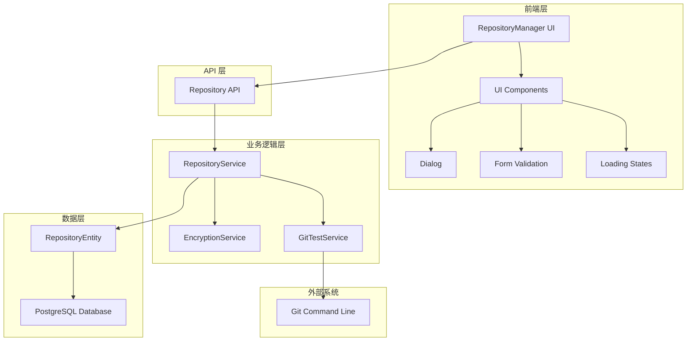

# repository-management - Task 10

Execute task 10 for the repository-management specification.

## Task Description
添加分页查询方法

## Code Reuse
**Leverage existing code**: TypeORM 分页查询模式

## Requirements Reference
**Requirements**: Non-functional Scalability

## Usage
```
/Task:10-repository-management
```

## Instructions

Execute with @spec-task-executor agent the following task: "添加分页查询方法"

```
Use the @spec-task-executor agent to implement task 10: "添加分页查询方法" for the repository-management specification and include all the below context.

# Steering Context
## Steering Documents Context

No steering documents found or all are empty.

# Specification Context
## Specification Context (Pre-loaded): repository-management

### Requirements
# Repository Management - Requirements

## Introduction

仓库管理功能是 AI Orchestra 平台的核心组件，提供完整的代码仓库 CRUD 操作、多种认证方式支持、连接测试和用户界面优化。该功能允许用户管理 Git 仓库和本地目录，支持无认证和多种认证方式（包括用户名密码、Personal Access Token 等），并提供现代化的用户界面体验。

## Alignment with Product Vision

该功能支持 AI Orchestra 作为分布式 AI 编程平台的核心目标：
- **多源代码管理**：支持多种代码来源，包括公共和私有仓库
- **安全认证**：提供多层次的安全认证机制，保护用户代码安全
- **用户体验**：现代化界面提升用户操作体验，降低使用门槛
- **测试验证**：完备的连接测试确保仓库配置正确性

## Requirements

### Requirement 1: 仓库 CRUD 操作

**User Story:** 作为平台管理员，我希望能够创建、查看、更新和删除代码仓库配置，以便管理所有可用的代码源。

#### Acceptance Criteria

1. WHEN 用户点击"添加仓库"按钮 THEN 系统应显示仓库创建表单
2. WHEN 用户填写必要信息并提交 THEN 系统应创建新的仓库记录
3. WHEN 用户查看仓库列表 THEN 系统应显示所有已配置仓库的基本信息
4. WHEN 用户点击编辑按钮 THEN 系统应打开预填充的编辑表单
5. WHEN 用户更新仓库信息并保存 THEN 系统应更新对应的仓库记录
6. WHEN 用户点击删除按钮 THEN 系统应显示确认对话框并执行删除操作
7. WHEN 删除操作完成 THEN 系统应从列表中移除该仓库

### Requirement 2: 多种认证方式支持

**User Story:** 作为开发者，我希望能够使用不同的认证方式访问仓库，包括无认证的公共仓库和需要凭据的私有仓库。

#### Acceptance Criteria

1. WHEN 配置公共仓库 THEN 系统应允许不填写认证凭据
2. WHEN 配置 GitHub 仓库 THEN 系统应支持 Personal Access Token 认证
3. WHEN 配置 GitLab 仓库 THEN 系统应支持 Personal/Project Access Token 认证
4. WHEN 配置 Bitbucket 仓库 THEN 系统应支持 App Password 认证
5. WHEN 配置通用 Git 仓库 THEN 系统应支持用户名:密码格式认证
6. WHEN 输入认证信息 THEN 系统应提供适当的占位符提示
7. WHEN 保存认证信息 THEN 系统应加密存储敏感数据
8. IF 用户选择无认证方式 THEN 系统应禁用认证字段输入
9. IF 认证信息格式错误 THEN 系统应显示格式提示和示例

### Requirement 3: 仓库连接测试

**User Story:** 作为用户，我希望能够测试仓库连接是否正常，以便确保配置的正确性。

#### Acceptance Criteria

1. WHEN 用户点击测试连接按钮 THEN 系统应验证仓库配置
2. WHEN 测试成功 THEN 系统应显示成功消息和可用分支列表
3. WHEN 测试失败 THEN 系统应显示具体的错误信息和解决建议
4. WHEN 测试 Git 仓库 THEN 系统应执行 git ls-remote 操作
5. WHEN 测试本地路径 THEN 系统应验证路径存在且可访问
6. WHEN 认证失败 THEN 系统应提示"认证失败：用户名密码或Token不正确"
7. WHEN 仓库不存在 THEN 系统应提示"仓库不存在或无权访问"
8. IF 网络连接超时 THEN 系统应自动重试最多 3 次
9. IF 连接测试进行中 THEN 系统应显示加载指示器并禁用测试按钮

### Requirement 4: 默认分支选择

**User Story:** 作为用户，我希望能够选择或自动识别仓库的默认分支，以便正确配置工作分支。

#### Acceptance Criteria

1. WHEN 测试连接成功 THEN 系统应自动识别默认分支（main/master）
2. WHEN 存在 main 分支 THEN 系统应优先选择 main 作为默认分支
3. WHEN 不存在 main 但存在 master THEN 系统应选择 master 作为默认分支
4. WHEN 既无 main 也无 master THEN 系统应选择第一个可用分支
5. WHEN 用户手动指定分支 THEN 系统应使用用户指定的分支
6. WHEN 分支不存在 THEN 系统应在测试时报告分支不可用

### Requirement 5: 使用 GitHub React 仓库测试

**User Story:** 作为开发者，我希望能够使用 Facebook 的 React 仓库作为测试案例，验证系统对大型公共仓库的支持。

#### Acceptance Criteria

1. WHEN 输入 React 仓库 URL (https://github.com/facebook/react.git) THEN 系统应成功连接
2. WHEN 测试 React 仓库连接 THEN 系统应返回可用分支列表
3. WHEN 选择 main 分支 THEN 系统应正确配置该分支
4. WHEN 克隆 React 仓库 THEN 系统应能创建工作区
5. WHEN 无需认证 THEN 系统应正常访问公共仓库

### Requirement 6: 改进添加仓库对话框界面

**User Story:** 作为用户，我希望添加仓库的对话框有良好的视觉效果，而不是纯黑背景，提供正常的弹窗体验。

#### Acceptance Criteria

1. WHEN 点击添加仓库按钮 THEN 对话框应有半透明的背景遮罩
2. WHEN 对话框打开 THEN 应有合适的阴影和圆角边框
3. WHEN 对话框显示 THEN 内容应居中且有适当的内边距
4. WHEN 对话框打开 THEN 应有平滑的过渡动画效果
5. WHEN 点击遮罩区域或取消按钮 THEN 对话框应正确关闭
6. WHEN 对话框内容较多 THEN 应支持垂直滚动
7. WHEN 在不同屏幕尺寸下 THEN 对话框应响应式适配

## Non-Functional Requirements

### Performance
- 仓库连接测试应在 15 秒内完成
- 仓库列表加载应在 2 秒内完成
- 对话框动画应流畅，无明显卡顿

### Security
- 所有认证凭据必须加密存储
- API 调用必须通过身份验证
- 敏感信息不得在前端明文显示
- 加密算法使用 AES-256-CBC

### Reliability
- 网络连接失败应有重试机制（最多 3 次）
- 系统异常应有适当的错误处理
- 数据操作应有事务保护
- 仓库配置变更应记录操作日志

### Usability
- 界面操作应直观易懂
- 错误消息应提供明确的解决建议
- 表单验证应实时反馈
- 支持键盘导航和辅助功能

### Scalability
- 支持最多 1000 个仓库配置
- 仓库列表应支持分页（每页 20 个）
- 支持按名称和类型搜索仓库

### Availability
- 仓库配置数据应定期备份
- 支持仓库配置的导入和导出

---

### Design
# Repository Management - Design

## Overview

仓库管理功能是一个完整的全栈解决方案，包含前端 React 组件、后端 NestJS 服务、数据库实体和 API 接口。该功能基于现有的架构模式，复用现有组件和服务，同时增强用户界面和功能体验。

## Steering Document Alignment

### Technical Standards (tech.md)
设计遵循项目的技术标准：
- **后端**: NestJS + TypeORM + PostgreSQL 架构
- **前端**: React + TypeScript + TailwindCSS
- **认证**: JWT + Guards 机制
- **数据加密**: AES-256-CBC 算法
- **API 设计**: RESTful 风格

### Project Structure (structure.md)
实现将遵循项目组织约定：
- **实体**: `packages/server/src/entities/`
- **服务**: `packages/server/src/services/`
- **控制器**: `packages/server/src/controllers/`
- **组件**: `packages/web/src/components/repository/`
- **存储**: `packages/web/src/store/`

## Code Reuse Analysis

### Existing Components to Leverage
- **RepositoryEntity**: 现有数据模型 (packages/server/src/entities/repository.entity.ts)
- **RepositoryService**: 基础服务逻辑 (packages/server/src/services/repository.service.ts)
- **RepositoryController**: 现有 API 端点 (packages/server/src/controllers/repository.controller.ts)
- **RepositoryManager**: 前端组件基础 (packages/web/src/components/repository/RepositoryManager.tsx)
- **UI 组件库**: Dialog, Button, Input 等 (packages/web/src/components/ui/)

### Integration Points
- **认证系统**: 使用现有的 JWT Guards 和 useAuthStore
- **数据库**: 复用现有 TypeORM 配置和连接
- **WebSocket**: 集成现有 ChatGateway 用于实时状态更新
- **加密服务**: 扩展现有的认证加密机制

## Architecture



## Requirements Traceability

### Requirement 1 (CRUD Operations) → Design Solutions
- **RepositoryManager Component**: 提供完整的创建、读取、更新、删除界面
- **Enhanced Dialog Component**: 解决表单显示和交互问题
- **Repository API Extensions**: 提供完整的 RESTful CRUD 端点

### Requirement 2 (Authentication) → Design Solutions
- **Credential Parser**: 解析不同平台的认证格式
- **Encryption Service**: 使用随机 IV 的安全加密存储
- **Dynamic Form Validation**: 根据仓库类型动态显示认证字段

### Requirement 3 (Connection Testing) → Design Solutions
- **Connection Test Engine**: 实现重试机制和详细错误报告
- **Retry Strategy**: 指数退避重试，最多 3 次
- **Real-time Feedback**: 显示测试进度和加载状态

### Requirement 4 (Branch Selection) → Design Solutions
- **Branch Discovery Service**: 自动获取和解析分支列表
- **Smart Default Selection**: 优先选择 main > master > 第一个可用分支
- **Branch Validation**: 验证用户指定分支的存在性

### Requirement 5 (React Repository Testing) → Design Solutions
- **Public Repository Support**: 特殊处理无认证的公共仓库
- **Large Repository Optimization**: 针对大型仓库的超时和性能优化
- **Test Case Integration**: 内置 React 仓库作为测试用例

### Requirement 6 (Dialog UI Improvement) → Design Solutions
- **Modern Dialog Component**: 半透明背景、圆角边框、阴影效果
- **Responsive Design**: 适配不同屏幕尺寸的弹窗布局
- **Smooth Animations**: CSS 过渡动画和加载状态

## Components and Interfaces

### Component 1: Enhanced RepositoryManager
- **Purpose:** 提供现代化的仓库管理界面
- **Interfaces:** 
  - `loadRepositories()`: 加载仓库列表
  - `handleSubmit()`: 处理表单提交
  - `handleTestConnection()`: 测试仓库连接
  - `handleDelete()`: 删除仓库
- **Dependencies:** useAuthStore, API_BASE_URL, UI 组件
- **Reuses:** 现有 RepositoryManager 组件作为基础，增强对话框界面

### Component 2: Enhanced Dialog Component
- **Purpose:** 提供改进的对话框用户体验
- **Interfaces:**
  - `onOpen()`: 打开对话框
  - `onClose()`: 关闭对话框
  - `renderContent()`: 渲染内容
- **Dependencies:** React Portal, TailwindCSS 动画
- **Reuses:** 集成现有 UI 组件库的 Dialog 基础组件

### Component 3: Enhanced RepositoryService
- **Purpose:** 扩展仓库业务逻辑和测试功能
- **Interfaces:**
  - `testConnectionWithRetry()`: 带重试的连接测试
  - `validateCredentials()`: 验证认证信息
  - `getBranchList()`: 获取分支列表
  - `logOperation()`: 记录操作日志
- **Dependencies:** TypeORM, crypto, child_process
- **Reuses:** 扩展现有 RepositoryService，增加重试和日志功能

### Component 4: Connection Test Engine
- **Purpose:** 处理各种类型仓库的连接测试
- **Interfaces:**
  - `testGitRepository()`: 测试 Git 仓库
  - `testLocalPath()`: 测试本地路径
  - `parseAuthCredentials()`: 解析认证信息
  - `retryWithBackoff()`: 指数退避重试
- **Dependencies:** Git CLI, fs/promises
- **Reuses:** 基于现有 testConnection 和 testConfig 方法

### Component 5: Enhanced Repository API
- **Purpose:** 提供扩展的 API 端点
- **Interfaces:**
  - `POST /repositories/test-connection-retry`: 带重试的连接测试
  - `GET /repositories/search?q=query&type=git|local`: 搜索仓库
  - `GET /repositories/paginated?page=1&limit=20`: 分页获取仓库
  - `POST /repositories/bulk-test`: 批量测试仓库连接
  - `GET /repositories/:id/audit-log`: 获取操作日志
- **Dependencies:** NestJS Guards, RepositoryService
- **Reuses:** 扩展现有 RepositoryController

### Component 6: Audit Log Service
- **Purpose:** 记录仓库操作的审计日志
- **Interfaces:**
  - `logOperation(action, repositoryId, userId, details)`: 记录操作
  - `getAuditLog(repositoryId, pagination)`: 获取审计日志
  - `cleanupOldLogs(retentionDays)`: 清理旧日志
- **Dependencies:** TypeORM, Logger
- **Reuses:** 集成现有日志系统

### Component 7: Search and Pagination Service
- **Purpose:** 提供仓库搜索和分页功能
- **Interfaces:**
  - `searchRepositories(query, filters, pagination)`: 搜索仓库
  - `getPaginatedList(page, limit, sortBy)`: 分页列表
  - `buildSearchQuery(criteria)`: 构建搜索查询
- **Dependencies:** TypeORM QueryBuilder
- **Reuses:** 基于现有 Repository 模式

## Data Models

### Enhanced Repository Entity
```typescript
interface RepositoryEntity {
  id: string
  name: string
  description?: string
  url: string
  type: 'git' | 'local' | 'svn'
  branch?: string
  localPath?: string
  enabled: boolean
  credentials?: string  // 使用随机 IV 加密存储
  settings?: {
    autoUpdate?: boolean
    cachePath?: string
    retryCount?: number
    connectionTimeout?: number
  }
  metadata?: {
    lastTestDate?: Date
    lastTestResult?: TestResult
    availableBranches?: string[]
    defaultBranch?: string
  }
  createdAt: Date
  updatedAt: Date
}
```

### Audit Log Entity
```typescript
interface AuditLogEntity {
  id: string
  repositoryId: string
  userId: string
  action: 'create' | 'update' | 'delete' | 'test' | 'clone'
  details: {
    changes?: Record<string, any>
    testResult?: TestResult
    errorMessage?: string
  }
  timestamp: Date
  ipAddress?: string
  userAgent?: string
}
```

### Test Result Model
```typescript
interface TestResult {
  success: boolean
  message: string
  timestamp: Date
  details?: {
    branches?: string[]
    defaultBranch?: string
    isGitRepo?: boolean
    errorType?: 'auth' | 'host' | 'not_found' | 'timeout' | 'unknown'
    retryCount?: number
  }
}
```

### Repository Form Data
```typescript
interface RepositoryFormData {
  name: string
  description: string
  url: string
  type: 'git' | 'local'
  branch: string
  localPath: string
  credentials: string
  enabled: boolean
  autoUpdate: boolean
  connectionTimeout: number
}
```

## Error Handling

### Error Scenarios
1. **网络连接失败**
   - **Handling:** 自动重试最多 3 次，使用指数退避策略
   - **User Impact:** 显示重试进度，提供取消选项

2. **认证失败**
   - **Handling:** 记录失败原因，提供特定平台的帮助信息
   - **User Impact:** 显示具体错误和解决建议

3. **仓库不存在**
   - **Handling:** 验证 URL 格式，检查网络可达性
   - **User Impact:** 提示检查仓库 URL 和权限

4. **本地路径无效**
   - **Handling:** 验证路径存在性和权限
   - **User Impact:** 显示路径错误和权限要求

5. **并发操作冲突**
   - **Handling:** 使用数据库锁和版本控制
   - **User Impact:** 提示刷新数据后重试

## Testing Strategy

### Unit Testing
- **RepositoryService**: 
  - 测试 CRUD 操作（create, findAll, update, delete）
  - 测试加密解密逻辑（使用随机 IV）
  - 测试连接测试逻辑和重试机制
  - 测试认证信息解析和验证
- **Connection Test Engine**: 
  - 测试 Git 仓库连接（成功/失败场景）
  - 测试本地路径验证
  - 测试网络超时和重试机制（最多 3 次）
  - 测试不同平台的认证方式
- **Form Validation**: 
  - 测试 URL 格式验证
  - 测试认证信息格式验证
  - 测试必填字段验证
- **UI Components**: 
  - 测试对话框的打开/关闭
  - 测试表单提交和验证
  - 测试加载状态和错误显示

### Integration Testing
- **API Endpoints**: 
  - 测试 `/repositories` CRUD 操作
  - 测试 `/repositories/search` 搜索功能
  - 测试 `/repositories/paginated` 分页功能
  - 测试 `/repositories/test-config` 连接测试
- **Database Operations**: 
  - 测试仓库数据的持久化
  - 测试审计日志记录
  - 测试事务回滚机制
- **Git Integration**: 
  - 使用 React 仓库测试公共仓库访问
  - 使用私有测试仓库测试认证流程
  - 测试大型仓库的性能表现
- **Authentication Flow**: 
  - 测试 JWT token 验证
  - 测试权限控制
  - 测试用户会话管理

### End-to-End Testing
- **Complete CRUD Workflow**: 
  1. 创建新仓库 → 测试连接 → 保存配置
  2. 编辑现有仓库 → 更新认证信息 → 重新测试
  3. 删除仓库 → 确认删除 → 验证清理
- **Multi-auth Scenarios**: 
  - GitHub PAT 认证流程
  - GitLab Token 认证流程
  - Bitbucket App Password 认证流程
  - 用户名密码认证流程
  - 无认证公共仓库流程
- **Error Recovery**: 
  - 网络中断恢复测试
  - 认证失败重试测试
  - 仓库不可用时的错误处理
- **UI Responsiveness**: 
  - 桌面端界面测试（1920x1080）
  - 平板端界面测试（768x1024）
  - 移动端界面测试（375x667）

## Implementation Phases

### Phase 1: Backend Enhancement
- 扩展 RepositoryService 的重试和日志功能
- 增强 RepositoryController 的 API 端点
- 优化数据库查询和分页支持

### Phase 2: Frontend UI Improvement
- 改进对话框组件的视觉效果
- 增强表单验证和用户反馈
- 实现响应式设计和辅助功能

### Phase 3: Testing Integration
- 实现连接测试的完整流程
- 添加分支选择和自动识别功能
- 集成 React 仓库测试案例

### Phase 4: Advanced Features
- 实现搜索和分页功能
- 添加操作日志和审计功能
- 支持批量操作和导入导出

## Security Considerations

- **认证凭据加密**: 使用 AES-256-CBC 加密存储所有敏感信息
- **API 安全**: 所有端点都需要 JWT 认证
- **输入验证**: 严格验证所有用户输入，防止注入攻击
- **日志脱敏**: 操作日志中不包含敏感信息
- **权限控制**: 基于用户角色控制仓库操作权限

## Performance Optimization

- **连接池**: 复用数据库连接提高性能
- **缓存机制**: 缓存仓库连接测试结果（5分钟有效期）
- **分页加载**: 大量仓库时使用分页避免性能问题（每页 20 个）
- **异步处理**: 连接测试使用异步处理避免阻塞
- **防抖优化**: 表单输入使用防抖减少验证频率（300ms）
- **索引优化**: 为搜索字段（name, type, url）添加数据库索引
- **压缩传输**: API 响应使用 gzip 压缩减少传输时间

## Performance Benchmarks

- **仓库列表加载**: < 2 秒（1000 个仓库）
- **连接测试**: < 15 秒（包含重试）
- **搜索响应**: < 500ms（100 个仓库）
- **对话框动画**: 60fps 流畅度
- **分页切换**: < 300ms 响应时间

## Security Enhancements

### Fixed Encryption Implementation
```typescript
// 改进的加密服务，使用随机 IV
class ImprovedEncryptionService {
  private readonly algorithm = 'aes-256-cbc'
  private readonly key = crypto.scryptSync(process.env.ENCRYPTION_KEY, 'salt', 32)

  encrypt(text: string): string {
    const iv = crypto.randomBytes(16) // 每次生成随机 IV
    const cipher = crypto.createCipheriv(this.algorithm, this.key, iv)
    let encrypted = cipher.update(text, 'utf8', 'hex')
    encrypted += cipher.final('hex')
    return iv.toString('hex') + ':' + encrypted
  }

  decrypt(text: string): string {
    const [ivHex, encrypted] = text.split(':')
    const iv = Buffer.from(ivHex, 'hex')
    const decipher = crypto.createDecipheriv(this.algorithm, this.key, iv)
    let decrypted = decipher.update(encrypted, 'hex', 'utf8')
    decrypted += decipher.final('utf8')
    return decrypted
  }
}
```

### Specific UI Improvements for Dialog
```css
/* 解决"纯黑背景"问题的具体样式 */
.repository-dialog-overlay {
  background: rgba(0, 0, 0, 0.5); /* 半透明背景而非纯黑 */
  backdrop-filter: blur(4px); /* 背景模糊效果 */
}

.repository-dialog {
  background: white;
  border-radius: 12px; /* 圆角边框 */
  box-shadow: 0 20px 25px -5px rgba(0, 0, 0, 0.1), 
              0 10px 10px -5px rgba(0, 0, 0, 0.04); /* 阴影效果 */
  transform: scale(0.95);
  transition: all 0.2s ease-out; /* 平滑动画 */
}

.repository-dialog.open {
  transform: scale(1);
}
```

**Note**: Specification documents have been pre-loaded. Do not use get-content to fetch them again.

## Task Details
- Task ID: 10
- Description: 添加分页查询方法
- Leverage: TypeORM 分页查询模式
- Requirements: Non-functional Scalability

## Instructions
- Implement ONLY task 10: "添加分页查询方法"
- Follow all project conventions and leverage existing code
- Mark the task as complete using: claude-code-spec-workflow get-tasks repository-management 10 --mode complete
- Provide a completion summary
```

## Task Completion
When the task is complete, mark it as done:
```bash
claude-code-spec-workflow get-tasks repository-management 10 --mode complete
```

## Next Steps
After task completion, you can:
- Execute the next task using /repository-management-task-[next-id]
- Check overall progress with /spec-status repository-management
