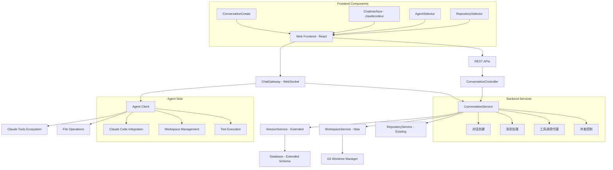

# Design Document - Agent对话系统

## Overview

Agent对话系统是AI Orchestra平台的核心功能模块，实现用户通过Web界面与已连接的Agent进行实时对话。该系统基于现有的ChatGateway、WebSocket通信架构和claudecodeui的ChatInterface组件，支持多仓库管理、分支隔离、Claude工具生态集成，为用户提供类似Claude Code的交互体验。

## Steering Document Alignment

### Technical Standards (tech.md)
本设计严格遵循项目既定的技术规范：
- **TypeScript规范**: 使用interface定义类型，禁止any，严格模式开发
- **React规范**: 函数组件+Hooks，组件PascalCase命名，Props接口以ComponentNameProps命名
- **文件组织**: 相关文件就近放置，公共组件放shared/components/，页面组件放pages/
- **代码长度限制**: 单个文件不超过300行，React组件不超过200行，函数不超过50行
- **状态管理**: 使用Zustand进行状态管理
- **API规范**: RESTful API设计，WebSocket事件使用冒号分隔的命名空间

### Project Structure (structure.md)
按照现有项目结构组织代码：
- **packages/server**: NestJS后端服务
- **packages/web**: React前端应用
- **packages/agent**: TypeScript Agent客户端
- **claudecodeui**: 复用现有ChatInterface组件

## Code Reuse Analysis

### Existing Components to Leverage
- **ChatGateway**: 扩展现有WebSocket网关支持对话功能，复用Agent认证、消息路由、会话管理机制
- **ChatInterface (claudecodeui)**: 直接集成现有的对话界面组件，包含消息展示、工具调用显示、文件引用等功能
- **Session/SessionMessage实体**: 扩展现有会话和消息实体，增加AI工具类型、Agent绑定、工具调用元数据字段
- **RepositoryEntity**: 复用现有仓库管理实体和认证机制
- **WebSocket Store**: 扩展现有WebSocket状态管理，增加对话事件处理

### Integration Points
- **Agent管理**: 集成现有的Agent注册、认证、状态管理系统
- **仓库管理**: 使用现有的Repository实体、认证系统和权限控制
- **用户认证**: 复用现有的JWT认证和RBAC权限控制
- **数据库**: 扩展现有SQLite数据库schema，新增对话相关字段和索引

## Architecture

本系统采用分层架构设计，充分复用现有系统组件：



## Components and Interfaces

### Frontend Components

#### ConversationCreate
- **Purpose:** 对话创建向导，引导用户选择Agent、仓库和配置参数
- **Interfaces:** 
  - `props: { onConversationCreate: (config) => void }`
  - `handleAgentSelect(agentId: string): void`
  - `handleRepositorySelect(repositoryIds: string[]): void`
  - `handleConfigurationSave(config: ConversationConfig): void`
- **Dependencies:** AgentSelector, RepositorySelector, WebSocket Store
- **Reuses:** 现有的Agent状态展示组件、Repository选择器组件

#### ChatInterface (claudecodeui集成)
- **Purpose:** 基于claudecodeui的对话界面，处理消息展示、工具调用可视化
- **Interfaces:**
  - `props: ConversationChatProps`
  - `handleMessageSend(message: string): void`
  - `handleToolCall(toolName: string, params: any): void`
  - `handleFileReference(filePath: string): void`
- **Dependencies:** WebSocket连接、文件树组件、工具设置
- **Reuses:** claudecodeui/src/components/ChatInterface.jsx完整组件

#### AgentSelector
- **Purpose:** Agent选择和状态显示，支持延迟显示和负载信息
- **Interfaces:**
  - `props: { agents: Agent[], onSelect: (agent) => void }`
  - `refreshAgentStatus(): void`
  - `showAgentDetails(agentId: string): void`
- **Dependencies:** Agent服务、WebSocket连接
- **Reuses:** 现有的Agent状态组件和监控组件

#### RepositorySelector
- **Purpose:** 仓库选择、权限验证和配置管理
- **Interfaces:**
  - `props: { repositories: Repository[], onSelect: (repos) => void }`
  - `validateRepositoryAccess(repoId: string): Promise<boolean>`
  - `configureRepository(repoId: string, config: RepoConfig): void`
- **Dependencies:** Repository服务、认证服务
- **Reuses:** 现有的RepositoryManager和认证组件

### Backend Services

#### ConversationService
- **Purpose:** 对话创建、管理、持久化的核心业务逻辑
- **Interfaces:**
  - `createConversation(config: ConversationConfig): Promise<Conversation>`
  - `sendMessage(conversationId: string, message: Message): Promise<void>`
  - `handleToolCall(conversationId: string, toolCall: ToolCall): Promise<ToolResult>`
  - `getConversationHistory(conversationId: string): Promise<Message[]>`
- **Dependencies:** SessionService, WorkspaceService, AgentService
- **Reuses:** 现有SessionService的会话管理逻辑

#### WorkspaceService
- **Purpose:** 工作区管理、Git worktree操作、文件隔离
- **Interfaces:**
  - `createWorkspace(conversationId: string, repositories: Repository[]): Promise<Workspace>`
  - `switchRepository(workspaceId: string, repositoryId: string): Promise<string>`
  - `cleanupWorkspace(workspaceId: string): Promise<void>`
  - `getWorkspaceStatus(workspaceId: string): Promise<WorkspaceStatus>`
- **Dependencies:** RepositoryService, FileSystem
- **Reuses:** 现有RepositoryService的仓库克隆和认证逻辑

#### ToolIntegrationService
- **Purpose:** Claude工具调用代理、权限验证、结果处理
- **Interfaces:**
  - `executeToolCall(toolName: string, params: any, context: ExecutionContext): Promise<ToolResult>`
  - `validateToolPermissions(toolName: string, params: any, user: User): Promise<boolean>`
  - `proxyToolCall(agentId: string, toolCall: ToolCall): Promise<ToolResult>`
- **Dependencies:** Agent通信、权限服务
- **Reuses:** 现有的权限验证和Agent通信机制

### WebSocket Extensions

#### 新增WebSocket事件
```typescript
// 对话管理事件
'conversation:create' // 创建新对话
'conversation:join'   // 加入对话会话
'conversation:leave'  // 离开对话会话
'conversation:message' // 发送/接收消息
'conversation:typing'  // 打字状态指示

// 工具调用事件
'conversation:tool_call_start'  // 工具调用开始
'conversation:tool_call_result' // 工具调用结果
'conversation:tool_call_error'  // 工具调用错误

// 工作区事件
'workspace:create'     // 创建工作区
'workspace:switch'     // 切换仓库
'workspace:status'     // 工作区状态更新
'workspace:cleanup'    // 清理工作区

// Agent状态事件（扩展现有）
'agent:conversation_assigned' // Agent分配到对话
'agent:conversation_released' // Agent从对话释放
```

## Data Models

### 扩展Session实体
```typescript
// 基于现有Session实体扩展
interface ConversationSession extends Session {
  // 新增字段
  agentId: string                    // 绑定的Agent ID
  repositoryIds: string[]            // 关联的仓库ID列表
  workspaceId?: string               // 工作区ID
  toolSettings: {                    // 工具配置
    allowedTools: string[]
    disallowedTools: string[]
    autoApprove: boolean
  }
  
  // 扩展现有字段
  aiTool: 'claude' | 'codex' | 'other' // 扩展AI工具类型
  metadata: {
    branch?: string
    lastActivity?: Date
    tokenUsage?: number
    
    // 新增元数据
    activeRepository?: string         // 当前活跃仓库
    workspaceStatus?: 'creating' | 'ready' | 'busy' | 'error'
    concurrentSessions?: number       // 并发会话数量
    toolCallCount?: number           // 工具调用次数
  }
}
```

### 扩展SessionMessage实体
```typescript
// 基于现有SessionMessage实体扩展
interface ConversationMessage extends SessionMessage {
  // 扩展现有字段
  from: 'user' | 'assistant' | 'system' | 'tool' // 扩展消息来源
  metadata: {
    tool?: string
    agentId?: string
    workerId?: string
    usage?: {
      input_tokens: number
      output_tokens: number
    }
    error?: string
    
    // 新增元数据
    toolCall?: {                     // 工具调用信息
      id: string
      name: string
      parameters: any
      result?: any
      error?: string
      executionTime?: number
    }
    fileReferences?: string[]        // 文件引用列表
    repositoryContext?: string       // 仓库上下文
    workspaceSnapshot?: string       // 工作区快照ID
  }
}
```

### 新增Workspace实体
```typescript
interface Workspace {
  id: string
  conversationId: string             // 关联的对话ID
  agentId: string                    // 管理此工作区的Agent
  repositories: WorkspaceRepository[] // 工作区中的仓库
  activeRepositoryId?: string        // 当前活跃仓库
  status: 'creating' | 'ready' | 'busy' | 'error' | 'cleanup'
  lastActivity: Date
  createdAt: Date
  expiresAt?: Date                   // 自动清理时间
}

interface WorkspaceRepository {
  repositoryId: string
  localPath: string                  // 本地工作目录路径
  branch: string                     // 工作分支
  worktreeId?: string               // Git worktree ID
  lastSync: Date
  status: 'cloning' | 'ready' | 'syncing' | 'error'
}
```

### 对话配置模型
```typescript
interface ConversationConfig {
  agentId: string                    // 选择的Agent
  repositoryIds: string[]            // 选择的仓库列表
  aiModel: 'claude-sonnet-4' | 'claude-haiku' | 'other' // AI模型
  toolSettings: {
    allowedTools: string[]
    disallowedTools: string[]
    autoApprove: boolean
    skipPermissions: boolean
  }
  workspaceSettings: {
    autoCleanup: boolean
    maxIdleTime: number              // 最大空闲时间（分钟）
    resourceLimits: {
      maxDiskUsage: number           // 最大磁盘使用（MB）
      maxConcurrentTasks: number
    }
  }
}
```

## Error Handling

### Error Scenarios

1. **Agent连接失败**
   - **Handling:** 实时检测Agent状态，提供备选Agent列表，自动重连机制
   - **User Impact:** 显示连接状态，提供手动重连选项，不中断用户输入

2. **仓库访问失败** 
   - **Handling:** 验证仓库权限，提供重新认证流程，缓存认证信息
   - **User Impact:** 清晰的错误提示，引导用户重新配置认证信息

3. **工作区创建失败**
   - **Handling:** 检查磁盘空间，清理过期工作区，提供降级方案
   - **User Impact:** 显示具体错误原因，提供手动清理选项

4. **工具调用超时**
   - **Handling:** 设置合理超时时间，提供中断机制，保存上下文状态
   - **User Impact:** 显示执行进度，提供取消操作，不丢失对话历史

5. **并发冲突**
   - **Handling:** 实现分布式锁，工作区隔离，队列管理
   - **User Impact:** 排队提示，预估等待时间，提供优先级选择

6. **消息丢失**
   - **Handling:** 消息确认机制，本地缓存，自动重发
   - **User Impact:** 重发提示，离线模式支持，数据一致性保证

## Testing Strategy

### Unit Testing
- **ConversationService**: 对话创建、消息处理、状态管理逻辑测试
- **WorkspaceService**: Git worktree操作、文件隔离、清理机制测试
- **WebSocket事件**: 消息路由、错误处理、重连机制测试
- **组件测试**: React组件渲染、用户交互、状态变更测试

### Integration Testing
- **WebSocket通信**: 前后端实时通信、消息序列化、错误传播测试
- **Agent集成**: Agent连接、工具调用、状态同步测试
- **数据库操作**: 会话持久化、消息存储、查询性能测试
- **文件系统**: 工作区创建、仓库克隆、权限验证测试

### End-to-End Testing
- **完整对话流程**: 从对话创建到消息交换到会话结束的完整测试
- **多仓库操作**: 仓库切换、文件操作、分支隔离的端到端测试
- **并发场景**: 多用户、多Agent、多仓库的并发访问测试
- **错误恢复**: 网络中断、Agent崩溃、数据丢失等异常场景测试

## Technical Implementation Details

### Git Worktree实现机制

```typescript
class GitWorktreeManager {
  async createWorktree(repoPath: string, branch: string, workspaceId: string): Promise<string> {
    const worktreePath = `/tmp/ai-orchestra-workspaces/${workspaceId}/${repoPath.split('/').pop()}`
    
    // 创建Git worktree，确保分支隔离
    await this.execGit(['worktree', 'add', '-b', `workspace-${workspaceId}`, worktreePath, branch], repoPath)
    
    return worktreePath
  }

  async cleanupWorktree(worktreePath: string): Promise<void> {
    // 安全清理，防止误删重要文件
    if (!worktreePath.includes('ai-orchestra-workspaces')) {
      throw new Error('Invalid worktree path')
    }
    
    await this.execGit(['worktree', 'remove', '--force', worktreePath])
  }
}
```

### 并发控制策略

```typescript
class ConcurrencyController {
  private repositoryLocks = new Map<string, Set<string>>() // repoId -> sessionIds
  
  async acquireRepositoryLock(repositoryId: string, sessionId: string): Promise<boolean> {
    const sessions = this.repositoryLocks.get(repositoryId) || new Set()
    
    // 同一仓库只允许一个活跃会话进行文件修改
    if (sessions.size > 0) {
      return false // 仓库被占用
    }
    
    sessions.add(sessionId)
    this.repositoryLocks.set(repositoryId, sessions)
    return true
  }
  
  releaseRepositoryLock(repositoryId: string, sessionId: string): void {
    const sessions = this.repositoryLocks.get(repositoryId)
    if (sessions) {
      sessions.delete(sessionId)
      if (sessions.size === 0) {
        this.repositoryLocks.delete(repositoryId)
      }
    }
  }
}
```

### 实时通信架构

```typescript
// 扩展现有ChatGateway
@WebSocketGateway()
export class ConversationGateway extends ChatGateway {
  @SubscribeMessage('conversation:create')
  async handleConversationCreate(
    @ConnectedSocket() client: Socket,
    @MessageBody() data: ConversationCreateRequest
  ): Promise<void> {
    // 验证Agent可用性
    const agent = this.connectedAgents.get(data.agentId)
    if (!agent) {
      client.emit('conversation:error', { error: 'Agent not available' })
      return
    }
    
    // 创建对话会话
    const conversation = await this.conversationService.createConversation(data.config)
    
    // 通知Agent准备工作区
    this.server.to(agent.socketId).emit('workspace:prepare', {
      conversationId: conversation.id,
      repositories: data.config.repositoryIds
    })
    
    client.emit('conversation:created', { conversationId: conversation.id })
  }
  
  @SubscribeMessage('conversation:message')
  async handleConversationMessage(
    @ConnectedSocket() client: Socket,
    @MessageBody() data: ConversationMessageRequest
  ): Promise<void> {
    // 路由消息到指定Agent
    const conversation = await this.conversationService.getConversation(data.conversationId)
    const agent = this.connectedAgents.get(conversation.agentId)
    
    if (agent) {
      this.server.to(agent.socketId).emit('conversation:message', {
        conversationId: data.conversationId,
        message: data.message,
        context: await this.getConversationContext(data.conversationId)
      })
    }
  }
}
```

### 安全认证机制

```typescript
class ConversationAuthService {
  async validateConversationAccess(userId: string, conversationId: string): Promise<boolean> {
    const conversation = await this.conversationService.getConversation(conversationId)
    
    // 验证用户是否有权限访问对话关联的仓库
    for (const repoId of conversation.repositoryIds) {
      const hasAccess = await this.repositoryService.checkUserAccess(userId, repoId)
      if (!hasAccess) {
        return false
      }
    }
    
    return conversation.userId === userId
  }
  
  async encryptSensitiveData(data: any): Promise<string> {
    // 复用现有的加密服务加密敏感数据
    return this.encryptionService.encrypt(JSON.stringify(data))
  }
}
```

### 性能优化设计

#### 缓存策略
```typescript
class ConversationCacheService {
  private conversationCache = new Map<string, Conversation>()
  private messageCache = new LRUCache<string, Message[]>({ max: 1000 })
  
  async getCachedConversation(conversationId: string): Promise<Conversation | null> {
    // 1. 内存缓存
    if (this.conversationCache.has(conversationId)) {
      return this.conversationCache.get(conversationId)
    }
    
    // 2. Redis缓存（如果配置）
    // 3. 数据库查询
    const conversation = await this.conversationService.getConversation(conversationId)
    
    // 缓存结果
    this.conversationCache.set(conversationId, conversation)
    return conversation
  }
}
```

#### 资源管理
```typescript
class ResourceManager {
  private static readonly MAX_WORKSPACES_PER_AGENT = 10
  private static readonly WORKSPACE_TTL = 2 * 60 * 60 * 1000 // 2小时
  
  async cleanupExpiredWorkspaces(): Promise<void> {
    const expiredWorkspaces = await this.workspaceService.getExpiredWorkspaces()
    
    for (const workspace of expiredWorkspaces) {
      try {
        await this.workspaceService.cleanupWorkspace(workspace.id)
        console.log(`Cleaned up expired workspace: ${workspace.id}`)
      } catch (error) {
        console.error(`Failed to cleanup workspace ${workspace.id}:`, error)
      }
    }
  }
  
  async enforceResourceLimits(agentId: string): Promise<void> {
    const workspaces = await this.workspaceService.getAgentWorkspaces(agentId)
    
    if (workspaces.length > ResourceManager.MAX_WORKSPACES_PER_AGENT) {
      // 清理最久未使用的工作区
      const sortedWorkspaces = workspaces.sort((a, b) => 
        a.lastActivity.getTime() - b.lastActivity.getTime()
      )
      
      const toCleanup = sortedWorkspaces.slice(0, workspaces.length - ResourceManager.MAX_WORKSPACES_PER_AGENT)
      for (const workspace of toCleanup) {
        await this.workspaceService.cleanupWorkspace(workspace.id)
      }
    }
  }
}
```

### 扩展性考虑

#### 多AI工具支持架构
```typescript
interface AIToolProvider {
  name: string
  supportedModels: string[]
  
  createSession(config: AIToolConfig): Promise<AISession>
  sendMessage(sessionId: string, message: string): Promise<AIResponse>
  executeToolCall(sessionId: string, toolCall: ToolCall): Promise<ToolResult>
  destroySession(sessionId: string): Promise<void>
}

class ClaudeProvider implements AIToolProvider {
  name = 'claude'
  supportedModels = ['claude-sonnet-4', 'claude-haiku', 'claude-opus']
  
  async createSession(config: ClaudeConfig): Promise<ClaudeSession> {
    // Claude特定的会话创建逻辑
  }
  
  // ... 实现其他接口方法
}

class CodexProvider implements AIToolProvider {
  name = 'codex'
  supportedModels = ['code-davinci-002', 'code-cushman-001']
  
  // ... 实现接口方法
}
```

#### 插件系统支持
```typescript
interface ConversationPlugin {
  name: string
  version: string
  
  onConversationCreate?(conversation: Conversation): Promise<void>
  onMessageSend?(message: Message): Promise<Message> // 消息预处理
  onMessageReceive?(message: Message): Promise<Message> // 消息后处理
  onToolCall?(toolCall: ToolCall): Promise<ToolCall> // 工具调用拦截
  onConversationEnd?(conversation: Conversation): Promise<void>
}

class PluginManager {
  private plugins: ConversationPlugin[] = []
  
  registerPlugin(plugin: ConversationPlugin): void {
    this.plugins.push(plugin)
  }
  
  async executeHook(hookName: string, data: any): Promise<any> {
    let result = data
    
    for (const plugin of this.plugins) {
      const hookFunction = plugin[hookName]
      if (hookFunction) {
        result = await hookFunction(result)
      }
    }
    
    return result
  }
}
```

## Implementation Phases

### Phase 1: 基础架构搭建 (Week 1-2)
- 扩展Session/SessionMessage实体，新增对话相关字段
- 创建Workspace实体和WorkspaceService
- 扩展ChatGateway支持对话相关WebSocket事件
- 实现基础的ConversationService

### Phase 2: Agent选择和仓库管理 (Week 3-5)
- 开发AgentSelector组件，集成现有Agent状态监控
- 开发RepositorySelector组件，复用现有仓库管理
- 实现ConversationCreate向导组件
- 集成Git worktree工作区管理

### Phase 3: 对话界面和实时通信 (Week 6-9)
- 集成claudecodeui的ChatInterface组件
- 实现WebSocket消息路由和状态同步
- 开发工具调用可视化和文件引用功能
- 实现会话持久化和历史记录

### Phase 4: 工具集成和工作区管理 (Week 10-12)
- 集成Claude工具生态（Read, Write, Edit, Bash等）
- 实现工作区切换和并发控制
- 开发实时状态指示和进度展示
- 优化性能和资源管理

### Phase 5: 优化和扩展 (Week 13-14)
- 性能优化：缓存策略、资源清理、并发优化
- 安全加固：权限验证、数据加密、审计日志
- 扩展性：多AI工具接口、插件系统基础
- 测试完善：单元测试、集成测试、端到端测试

## Risk Mitigation

### 技术风险
- **WebSocket稳定性**: 实现心跳检测、自动重连、消息确认机制
- **Git操作安全**: 严格路径验证、权限检查、安全清理流程
- **内存泄漏**: 实现工作区TTL、定期清理、资源监控
- **并发竞争**: 分布式锁、工作区隔离、请求队列管理

### 业务风险
- **用户体验**: 渐进式加载、离线支持、错误恢复机制
- **数据安全**: 端到端加密、权限最小化、审计追踪
- **性能瓶颈**: 分层缓存、异步处理、负载均衡
- **扩展性**: 插件架构、配置管理、版本兼容

### 应对措施
- **原型验证**: 快速MVP验证关键技术可行性
- **增量发布**: 分阶段交付，降低单次发布风险
- **监控预警**: 完善监控体系，及时发现问题
- **灾难恢复**: 数据备份、快速回滚、服务降级

---

**文档版本**: v1.0  
**创建日期**: 2025-01-16  
**最后更新**: 2025-01-16  
**审核状态**: 待审核  
**技术负责人**: AI Orchestra开发团队