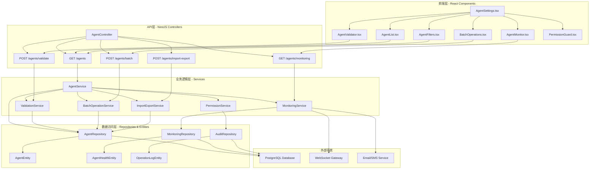

# Agent CRUD 功能增强（包括Agent校验） - Design

## Overview

Agent CRUD 功能增强是基于现有 AI Orchestra 系统的Agent管理模块进行的全面升级。当前系统已具备基础的Agent实体管理、服务层逻辑和前端界面，本次设计将在保持向后兼容的前提下，增强连接校验、健康监控、批量操作、高级查询、权限控制和配置管理功能。

设计目标是构建一个企业级的Agent管理系统，提供可靠的监控、高效的批量操作、灵活的权限控制和直观的用户体验。

## Steering Document Alignment

### Technical Standards (tech.md)

设计严格遵循项目技术标准：
- **后端架构**: 基于现有的 NestJS + TypeORM + PostgreSQL 技术栈
- **前端技术**: 使用 React + TypeScript + TailwindCSS，保持现有组件设计模式
- **API设计**: 遵循 RESTful 原则，扩展现有的 `/api/agents` 端点系列
- **数据加密**: 使用项目标准的 AES-256-CBC 加密算法存储敏感信息
- **认证机制**: 集成现有的 JWT + Guards 认证体系

### Project Structure (structure.md)

实现将严格遵循项目组织结构：
- **实体扩展**: 在 `packages/server/src/entities/` 下增强现有AgentEntity
- **服务增强**: 扩展 `packages/server/src/services/agent.service.ts` 和新增专门服务
- **控制器扩展**: 在 `packages/server/src/controllers/agent.controller.ts` 中添加新端点
- **前端组件**: 重构 `packages/web/src/components/settings/AgentSettings.tsx` 并新增子组件
- **类型定义**: 在相应的类型文件中扩展接口定义

## Code Reuse Analysis

### Existing Components to Leverage

**后端现有组件复用：**
- **AgentEntity**: 基础实体结构完整，扩展metadata字段存储监控数据
- **AgentService**: 核心CRUD逻辑完善，扩展校验和监控方法
- **AgentController**: REST API框架完整，添加新的端点方法
- **AgentRepository**: 数据访问基础扎实，扩展查询和批量操作方法
- **JwtAuthGuard**: 认证机制完善，直接集成权限控制
- **BaseRepository**: 通用数据操作模式，复用到新的监控服务

**前端现有组件复用：**
- **AgentSettings.tsx**: 基础UI框架完整，重构为模块化组件
- **useAuthStore**: 用户认证状态管理，集成权限判断逻辑
- **基础UI组件**: 按钮、表单、对话框等组件直接复用
- **API客户端**: 现有的fetch封装模式，扩展新的API调用

### Integration Points

**数据库集成：**
- **现有Agent表**: 扩展字段而非重建，保持数据连续性
- **用户认证表**: 集成权限控制，基于现有user表建立关联
- **审计日志**: 新建表但复用现有的TypeORM配置和连接

**API集成：**
- **现有认证中间件**: 直接集成，无需修改现有认证流程
- **WebSocket集成**: 复用现有ChatGateway模式实现实时监控
- **错误处理**: 基于现有错误处理机制，保持一致的错误响应格式

**前端状态管理：**
- **认证状态**: 基于现有useAuthStore，扩展权限相关状态
- **组件通信**: 复用现有的状态提升和事件传递模式

## Architecture



## Requirements Traceability

### Requirement 1 (Agent连接校验和状态监控) → Design Solutions
- **AgentValidationService**: 实现连接测试、健康检查和状态同步
- **Real-time Monitor Component**: 前端实时状态显示和测试结果展示
- **WebSocket Integration**: 基于现有ChatGateway模式实现实时状态推送

### Requirement 2 (高级筛选和搜索功能) → Design Solutions
- **Enhanced Repository Queries**: 扩展AgentRepository支持多条件复合查询
- **AgentFilters Component**: 前端高级筛选界面，支持实时搜索
- **Search Optimization**: 数据库索引优化和分页查询性能提升

### Requirement 3 (批量操作功能) → Design Solutions
- **BatchOperationService**: 专门的批量操作服务，支持事务处理
- **BatchOperations Component**: 前端批量选择和操作界面
- **Progress Tracking**: 批量操作进度跟踪和结果反馈机制

### Requirement 4 (数据验证和完整性检查) → Design Solutions
- **ValidationService**: 统一的数据验证服务，支持客户端和服务端验证
- **Form Validation Enhancement**: 前端表单实时验证和错误提示
- **Business Rules Engine**: 业务规则验证和冲突检测

### Requirement 5 (Agent健康监控和告警) → Design Solutions
- **MonitoringService**: 心跳监控、资源监控和告警服务
- **AgentHealthEntity**: 新的监控数据实体，存储历史监控数据
- **Alert System**: 基于阈值的告警系统，支持多种通知方式

### Requirement 6 (权限控制和访问管理) → Design Solutions
- **PermissionService**: 基于角色的权限控制服务
- **Permission Guards**: 扩展现有JwtAuthGuard，增加细粒度权限检查
- **Audit Logging**: 完整的操作审计日志系统

### Requirement 7 (Agent配置导入导出) → Design Solutions
- **ImportExportService**: 配置文件处理、数据迁移和冲突解决
- **File Upload Component**: 前端文件上传和导入进度显示
- **Configuration Validator**: 导入数据验证和格式检查

## Components and Interfaces

### Component 1: Enhanced AgentService
- **Purpose:** 扩展现有AgentService，增加校验、监控和批量操作功能
- **Interfaces:** 
  - `validateConnection(agentId: string): Promise<ValidationResult>`
  - `performBatchOperation(operation: BatchOperation): Promise<BatchResult>`
  - `getAgentsWithFilters(filters: AgentFilters): Promise<PaginatedAgents>`
- **Dependencies:** AgentRepository, ValidationService, MonitoringService
- **Reuses:** 现有AgentService的所有CRUD方法和业务逻辑

### Component 2: AgentValidationService
- **Purpose:** 专门处理Agent连接校验和状态验证
- **Interfaces:**
  - `testConnection(agent: Agent): Promise<ConnectionTestResult>`
  - `validateConfiguration(config: AgentConfig): ValidationResult`
  - `checkHeartbeat(agentId: string): Promise<HeartbeatResult>`
- **Dependencies:** HTTP客户端、超时控制、重试机制
- **Reuses:** 现有的加密服务验证密钥格式

### Component 3: MonitoringService
- **Purpose:** Agent健康监控、资源跟踪和告警管理
- **Interfaces:**
  - `startMonitoring(agentId: string): void`
  - `updateResourceMetrics(agentId: string, metrics: ResourceMetrics): void`
  - `checkAlertConditions(agentId: string): Promise<Alert[]>`
  - `sendAlert(alert: Alert): Promise<void>`
- **Dependencies:** WebSocket Gateway, 通知服务, AgentHealthRepository
- **Reuses:** 现有WebSocket基础设施和通知机制

### Component 4: BatchOperationService
- **Purpose:** 处理Agent的批量操作，确保操作原子性
- **Interfaces:**
  - `batchDelete(agentIds: string[], userId: string): Promise<BatchResult>`
  - `batchUpdateStatus(agentIds: string[], status: AgentStatus): Promise<BatchResult>`
  - `batchUpdateTags(agentIds: string[], tags: TagOperation): Promise<BatchResult>`
- **Dependencies:** AgentRepository, PermissionService, 事务管理器
- **Reuses:** 现有Repository的事务处理模式

### Component 5: PermissionService
- **Purpose:** 权限控制和访问管理
- **Interfaces:**
  - `checkAgentPermission(userId: string, agentId: string, action: string): boolean`
  - `getUserAccessibleAgents(userId: string): Promise<string[]>`
  - `logOperation(userId: string, operation: OperationLog): void`
- **Dependencies:** 用户认证服务, AuditRepository
- **Reuses:** 现有JWT用户信息和认证中间件

### Component 6: Enhanced Frontend Components
- **AgentFilters Component:**
  - **Purpose:** 高级筛选和搜索界面
  - **Interfaces:** `onFilterChange(filters: AgentFilters): void`
  - **Reuses:** 现有UI组件库和表单处理逻辑

- **BatchOperations Component:**
  - **Purpose:** 批量操作界面和进度显示
  - **Interfaces:** `onBatchOperation(operation: BatchOperation): void`
  - **Reuses:** 现有确认对话框和进度指示器

- **AgentMonitor Component:**
  - **Purpose:** 实时监控数据显示和历史图表
  - **Interfaces:** `renderMonitoringData(data: MonitoringData): JSX.Element`
  - **Reuses:** 现有图表库和WebSocket连接管理

## Data Models

### Enhanced Agent Entity
```typescript
// 扩展现有AgentEntity
interface EnhancedAgentEntity {
  // ... 现有字段保持不变
  id: string
  name: string
  secretKey: string
  status: 'pending' | 'connected' | 'offline'
  
  // 新增字段
  metadata: {
    lastValidationResult?: ValidationResult
    monitoringConfig?: MonitoringConfig
    alertRules?: AlertRule[]
    permissions?: PermissionConfig
  }
  
  // 扩展现有字段
  tags: string[] // 增加标签功能
  allowedTools: string[] // 扩展工具配置
  
  // 关联表
  healthHistory?: AgentHealthRecord[]
  operationLogs?: OperationLog[]
}
```

### Agent Health Entity
```typescript
interface AgentHealthEntity {
  id: string
  agentId: string
  timestamp: Date
  status: 'healthy' | 'warning' | 'critical'
  metrics: {
    cpuUsage: number
    memoryUsage: number
    diskUsage: number
    responseTime: number
    networkLatency: number
  }
  alerts?: Alert[]
  createdAt: Date
}
```

### Operation Log Entity
```typescript
interface OperationLogEntity {
  id: string
  agentId: string
  userId: string
  operation: 'create' | 'update' | 'delete' | 'validate' | 'batch_operation'
  details: {
    previousState?: any
    newState?: any
    batchSize?: number
    errorDetails?: string
  }
  success: boolean
  timestamp: Date
  ipAddress: string
  userAgent: string
}
```

### Validation Result Model
```typescript
interface ValidationResult {
  success: boolean
  timestamp: Date
  responseTime: number
  errorMessage?: string
  warnings?: string[]
  metrics?: {
    connectivity: boolean
    authentication: boolean
    resourceAvailability: boolean
  }
}
```

### Batch Operation Models
```typescript
interface BatchOperation {
  type: 'delete' | 'update_status' | 'update_tags'
  agentIds: string[]
  payload?: any
  userId: string
}

interface BatchResult {
  totalCount: number
  successCount: number
  failureCount: number
  skippedCount: number
  results: {
    agentId: string
    success: boolean
    error?: string
  }[]
}
```

## Error Handling

### Error Scenarios

1. **Agent连接测试失败**
   - **Handling:** 捕获网络异常、超时和认证错误，提供具体错误类型和解决建议
   - **User Impact:** 显示友好的错误信息和故障排除步骤

2. **批量操作部分失败**
   - **Handling:** 事务回滚机制，记录详细的成功/失败报告
   - **User Impact:** 显示操作摘要，允许用户重试失败的操作

3. **权限验证失败**
   - **Handling:** 统一的权限检查，返回403状态码和权限不足信息
   - **User Impact:** 显示清晰的权限要求和申请方式

4. **监控数据异常**
   - **Handling:** 数据验证和异常值过滤，防止错误告警
   - **User Impact:** 标记异常数据，提供数据质量指示

5. **导入配置冲突**
   - **Handling:** 智能冲突检测和解决建议，支持用户选择处理方式
   - **User Impact:** 交互式冲突解决界面，清晰的选择选项

## Testing Strategy

### Unit Testing
- **AgentService增强功能**: 
  - 测试校验逻辑的正确性和边界条件
  - 测试批量操作的事务处理和错误恢复
  - 测试权限检查和访问控制逻辑
- **ValidationService**: 
  - 测试各种连接场景和超时处理
  - 测试数据验证规则和错误信息生成
- **MonitoringService**: 
  - 测试告警规则和阈值检测
  - 测试心跳监控和状态同步
- **UI Components**: 
  - 测试筛选逻辑和搜索功能
  - 测试批量选择和操作确认流程
  - 测试实时数据显示和更新

### Integration Testing
- **API端点测试**: 
  - 测试所有新增的REST API端点
  - 测试权限控制和认证集成
  - 测试批量操作的完整流程
- **数据库集成**: 
  - 测试扩展实体的数据持久化
  - 测试复合查询和分页功能
  - 测试事务处理和数据一致性
- **WebSocket集成**: 
  - 测试实时监控数据推送
  - 测试连接状态同步
  - 测试告警消息传递
- **权限系统集成**: 
  - 测试基于角色的访问控制
  - 测试跨模块的权限检查
  - 测试审计日志记录

### End-to-End Testing
- **完整Agent管理流程**: 
  1. 创建Agent → 配置监控 → 测试连接 → 查看状态
  2. 批量操作 → 权限验证 → 操作执行 → 结果确认
  3. 导入配置 → 冲突解决 → 数据验证 → 成功导入
- **多用户权限场景**: 
  - 普通用户权限限制测试
  - 管理员权限完整性测试
  - 跨用户操作的权限隔离测试
- **监控和告警场景**: 
  - Agent状态变化的实时反映
  - 告警触发和通知发送
  - 历史数据查询和展示
- **系统负载测试**: 
  - 大量Agent并发管理
  - 批量操作性能测试
  - 监控数据处理能力测试

## Implementation Phases

### Phase 1: 核心扩展
- 扩展AgentEntity和相关数据模型
- 增强AgentService的核心功能
- 实现基础的校验和监控服务

### Phase 2: 前端增强
- 重构AgentSettings组件为模块化架构
- 实现高级筛选和搜索界面
- 添加批量操作和权限控制UI

### Phase 3: 监控系统
- 实现完整的健康监控服务
- 集成告警系统和通知机制
- 开发监控数据可视化组件

### Phase 4: 高级功能
- 实现导入导出功能
- 完善权限控制和审计系统
- 优化性能和用户体验

## Security Considerations

- **数据加密**: 继续使用现有的AES-256-CBC加密存储敏感信息
- **API安全**: 扩展现有JWT Guards，增加细粒度权限检查
- **输入验证**: 客户端和服务端双重验证，防止注入攻击
- **审计安全**: 完整的操作日志记录，支持安全审计
- **网络安全**: Agent连接使用加密传输，防止中间人攻击

## Performance Optimization

- **查询优化**: 为新增的搜索字段添加数据库索引
- **缓存策略**: 监控数据和权限信息使用Redis缓存
- **分页优化**: 大数据量场景下的高效分页查询
- **批量优化**: 批量操作使用事务和批处理优化
- **实时更新**: WebSocket连接复用和消息压缩
- **前端优化**: 虚拟滚动和懒加载优化大列表渲染