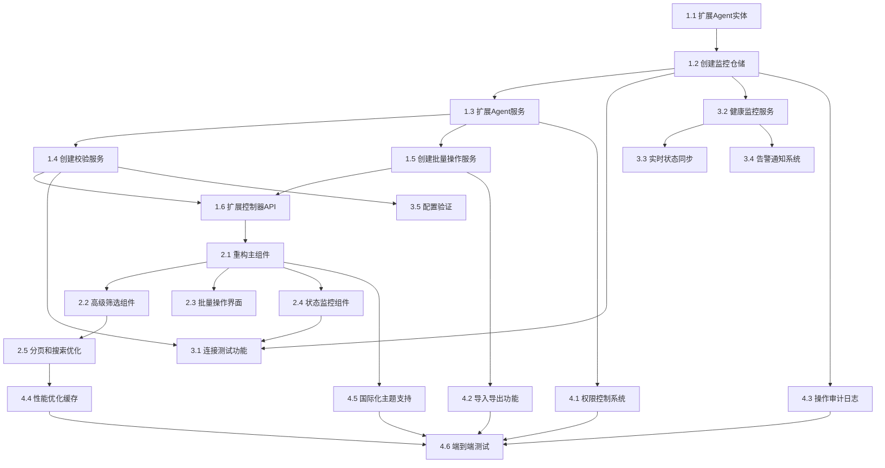

# Agent CRUD 功能增强 - 任务分解

## 概述

基于已完成的需求分析和设计文档，本任务分解将Agent CRUD功能增强分为4个主要阶段，共25个具体任务。每个任务都是原子性的、可独立测试的实现单元，包含明确的依赖关系和验证标准。

## 任务分类和优先级

### 阶段1：数据模型和核心服务扩展
**优先级：高 | 预计时间：5-7天**
- 数据库schema扩展
- 核心服务功能增强
- 基础API控制器扩展

### 阶段2：前端组件重构和基础功能
**优先级：高 | 预计时间：6-8天**
- 大型组件重构
- 基础筛选和搜索功能
- 批量操作界面

### 阶段3：监控和校验系统
**优先级：中 | 预计时间：8-10天**
- Agent连接校验
- 健康监控系统
- 实时状态管理

### 阶段4：高级功能和优化
**优先级：中低 | 预计时间：6-8天**
- 权限控制系统
- 导入导出功能
- 性能优化和测试

---

## 阶段1：数据模型和核心服务扩展

### Task 1.1 - 扩展Agent实体模型
**描述：** 在现有Agent实体基础上增加监控、校验和权限相关字段

**文件路径：**
- `packages/server/src/entities/agent.entity.ts`
- `packages/server/src/entities/agent-health.entity.ts` (新建)
- `packages/server/src/entities/operation-log.entity.ts` (新建)

**实现内容：**
1. 为Agent实体添加metadata字段存储扩展信息
2. 创建AgentHealth实体记录监控数据
3. 创建OperationLog实体记录操作审计
4. 添加必要的数据库索引优化查询性能

**验证标准：**
- [ ] 现有Agent数据迁移无损
- [ ] 新字段支持空值，保持向后兼容
- [ ] 数据库迁移脚本执行成功
- [ ] 实体关联关系正确建立

**依赖：** 无

---

### Task 1.2 - 创建Agent健康监控仓储
**描述：** 为Agent健康监控数据创建专门的Repository类

**文件路径：**
- `packages/server/src/repositories/agent-health.repository.ts` (新建)
- `packages/server/src/repositories/operation-log.repository.ts` (新建)

**实现内容：**
1. 实现AgentHealthRepository的CRUD操作
2. 添加按时间范围查询监控数据的方法
3. 实现监控数据的聚合和统计查询
4. 创建OperationLogRepository支持审计日志

**验证标准：**
- [ ] Repository类正确继承BaseRepository
- [ ] 所有查询方法返回正确的数据类型
- [ ] 支持分页查询和条件筛选
- [ ] 数据库连接和事务处理正确

**依赖：** Task 1.1

---

### Task 1.3 - 扩展Agent服务类核心功能
**描述：** 在现有AgentService基础上增加校验、监控和批量操作方法

**文件路径：**
- `packages/server/src/services/agent.service.ts`

**实现内容：**
1. 添加Agent配置验证方法
2. 实现批量操作的基础方法
3. 增加高级查询和筛选功能
4. 集成权限检查逻辑

**验证标准：**
- [ ] 所有新方法返回类型正确
- [ ] 现有方法功能不受影响
- [ ] 错误处理遵循项目标准
- [ ] 方法签名符合TypeScript严格模式

**依赖：** Task 1.2

---

### Task 1.4 - 创建Agent校验服务
**描述：** 创建专门的服务类处理Agent连接校验和配置验证

**文件路径：**
- `packages/server/src/services/agent-validation.service.ts` (新建)

**实现内容：**
1. 实现Agent连接测试功能
2. 添加配置数据验证规则
3. 实现超时控制和重试机制
4. 集成心跳检查逻辑

**验证标准：**
- [ ] 连接测试返回详细的状态信息
- [ ] 验证规则覆盖所有配置字段
- [ ] 超时处理不影响其他操作
- [ ] 错误信息提供明确的解决建议

**依赖：** Task 1.3

---

### Task 1.5 - 创建批量操作服务
**描述：** 实现Agent批量操作的专门服务，确保操作原子性

**文件路径：**
- `packages/server/src/services/batch-operation.service.ts` (新建)

**实现内容：**
1. 实现批量删除Agent功能
2. 添加批量状态更新方法
3. 实现批量标签操作
4. 集成事务处理确保数据一致性

**验证标准：**
- [ ] 批量操作支持事务回滚
- [ ] 操作结果包含详细的成功/失败信息
- [ ] 权限检查应用到每个操作项
- [ ] 性能满足100个Agent批量操作<60秒要求

**依赖：** Task 1.3

---

### Task 1.6 - 扩展Agent控制器API端点
**描述：** 在现有AgentController基础上添加新的REST API端点

**文件路径：**
- `packages/server/src/controllers/agent.controller.ts`

**实现内容：**
1. 添加`POST /agents/validate`端点进行连接测试
2. 添加`POST /agents/batch`端点支持批量操作
3. 添加`GET /agents/search`端点支持高级搜索
4. 更新现有端点支持新的查询参数

**验证标准：**
- [ ] 所有新端点返回正确的HTTP状态码
- [ ] API文档自动生成包含新端点
- [ ] 输入验证和错误处理完整
- [ ] 权限控制正确应用

**依赖：** Task 1.4, Task 1.5

---

## 阶段2：前端组件重构和基础功能

### Task 2.1 - 重构AgentSettings主组件
**描述：** 将740行的大型AgentSettings组件拆分为模块化的子组件

**文件路径：**
- `packages/web/src/components/settings/AgentSettings.tsx`
- `packages/web/src/components/settings/agents/AgentList.tsx` (新建)
- `packages/web/src/components/settings/agents/AgentForm.tsx` (新建)
- `packages/web/src/components/settings/agents/AgentCard.tsx` (新建)

**实现内容：**
1. 拆分AgentSettings为多个功能组件
2. 实现AgentList组件负责列表展示
3. 创建AgentForm组件处理表单操作
4. 设计AgentCard组件展示单个Agent信息

**验证标准：**
- [ ] 现有功能完全保持，无功能缺失
- [ ] 组件间通信通过props和回调正确实现
- [ ] 每个子组件文件不超过200行
- [ ] 组件复用性良好，可独立测试

**依赖：** Task 1.6

---

### Task 2.2 - 创建高级筛选组件
**描述：** 实现支持多条件筛选和实时搜索的AgentFilters组件

**文件路径：**
- `packages/web/src/components/settings/agents/AgentFilters.tsx` (新建)
- `packages/web/src/hooks/useAgentFilters.ts` (新建)

**实现内容：**
1. 实现名称、状态、标签的筛选器
2. 添加创建时间范围筛选
3. 实现实时搜索功能，300ms防抖
4. 支持筛选条件的保存和重置

**验证标准：**
- [ ] 筛选结果实时更新，响应时间<1秒
- [ ] 筛选条件正确组合，支持AND逻辑
- [ ] 搜索高亮匹配结果
- [ ] 筛选状态在页面刷新后保持

**依赖：** Task 2.1

---

### Task 2.3 - 实现批量操作界面
**描述：** 创建支持多选和批量操作的用户界面组件

**文件路径：**
- `packages/web/src/components/settings/agents/BatchOperations.tsx` (新建)
- `packages/web/src/components/settings/agents/BatchConfirmDialog.tsx` (新建)

**实现内容：**
1. 实现Agent多选复选框功能
2. 创建批量操作工具栏
3. 添加批量删除、状态更新和标签操作
4. 实现操作确认和进度显示

**验证标准：**
- [ ] 支持全选和部分选择
- [ ] 批量操作显示确认对话框
- [ ] 操作进度实时显示
- [ ] 操作结果展示详细的成功/失败信息

**依赖：** Task 2.1

---

### Task 2.4 - 创建Agent状态监控组件
**描述：** 实现显示Agent实时状态和历史监控数据的组件

**文件路径：**
- `packages/web/src/components/settings/agents/AgentMonitor.tsx` (新建)
- `packages/web/src/components/settings/agents/StatusIndicator.tsx` (新建)

**实现内容：**
1. 实现实时状态指示器组件
2. 添加资源使用率显示（CPU、内存、磁盘）
3. 创建连接延迟和响应时间展示
4. 实现简单的历史趋势图表

**验证标准：**
- [ ] 状态颜色和图标准确反映Agent状态
- [ ] 资源使用率数据实时更新
- [ ] 历史数据图表渲染正确
- [ ] 组件在无数据时显示合适的占位内容

**依赖：** Task 2.1

---

### Task 2.5 - 实现分页和搜索优化
**描述：** 为Agent列表添加分页功能和搜索性能优化

**文件路径：**
- `packages/web/src/components/settings/agents/AgentPagination.tsx` (新建)
- `packages/web/src/hooks/useAgentPagination.ts` (新建)

**实现内容：**
1. 实现分页组件，每页显示20个Agent
2. 添加页面跳转和页大小选择
3. 优化搜索请求，避免频繁API调用
4. 实现虚拟滚动（如果Agent数量>100）

**验证标准：**
- [ ] 分页导航正确显示总页数和当前页
- [ ] 页面跳转和Agent数据加载无延迟
- [ ] 搜索防抖正确实现（300ms）
- [ ] 大数据量情况下列表渲染性能良好

**依赖：** Task 2.2

---

## 阶段3：监控和校验系统

### Task 3.1 - 实现Agent连接测试功能
**描述：** 在前端添加Agent连接测试按钮和结果显示

**文件路径：**
- `packages/web/src/components/settings/agents/ConnectionTest.tsx` (新建)
- `packages/web/src/services/agent-validation.service.ts` (新建)

**实现内容：**
1. 添加"测试连接"按钮到Agent卡片
2. 实现连接测试结果的状态显示
3. 添加测试进度指示器和超时处理
4. 展示详细的连接信息（延迟、错误信息等）

**验证标准：**
- [ ] 测试按钮正确触发连接测试
- [ ] 测试结果准确显示连接状态
- [ ] 30秒超时后正确显示超时错误
- [ ] 错误信息提供明确的故障排除建议

**依赖：** Task 1.4, Task 2.4

---

### Task 3.2 - 创建Agent健康监控服务
**描述：** 实现后端健康监控服务，处理心跳和资源监控

**文件路径：**
- `packages/server/src/services/monitoring.service.ts` (新建)
- `packages/server/src/gateways/monitoring.gateway.ts` (新建)

**实现内容：**
1. 实现心跳监控逻辑，60秒检查间隔
2. 添加资源使用率阈值检查
3. 实现告警条件判断和触发机制
4. 集成WebSocket推送实时状态更新

**验证标准：**
- [ ] 心跳监控准确检测Agent在线状态
- [ ] 资源阈值告警按设计规则触发
- [ ] WebSocket推送状态更新及时到达前端
- [ ] 监控数据持久化到数据库正确

**依赖：** Task 1.2

---

### Task 3.3 - 实现实时状态同步
**描述：** 建立前后端实时状态同步机制

**文件路径：**
- `packages/web/src/hooks/useRealtimeAgentStatus.ts` (新建)
- `packages/web/src/store/agent.store.ts` (新建)

**实现内容：**
1. 实现WebSocket客户端连接管理
2. 添加Agent状态的实时更新逻辑
3. 集成状态变化的通知机制
4. 实现连接断开时的重连策略

**验证标准：**
- [ ] Agent状态变化在前端实时反映
- [ ] WebSocket连接断开后自动重连
- [ ] 状态更新不影响用户当前操作
- [ ] 同时支持多个Agent的状态监控

**依赖：** Task 3.2

---

### Task 3.4 - 创建告警和通知系统
**描述：** 实现Agent异常状态的告警和通知机制

**文件路径：**
- `packages/server/src/services/alert.service.ts` (新建)
- `packages/web/src/components/common/NotificationCenter.tsx` (新建)

**实现内容：**
1. 实现告警规则引擎和条件检查
2. 添加多种通知方式（邮件、短信、系统内通知）
3. 创建前端通知中心显示告警信息
4. 实现告警的确认和历史记录

**验证标准：**
- [ ] 告警规则按需求文档准确触发
- [ ] 通知正确发送到指定接收者
- [ ] 前端通知中心正确显示告警信息
- [ ] 告警历史记录完整保存

**依赖：** Task 3.2

---

### Task 3.5 - 实现Agent配置验证
**描述：** 创建前后端配置数据验证系统

**文件路径：**
- `packages/web/src/components/settings/agents/ConfigValidator.tsx` (新建)
- `packages/web/src/utils/validation.ts` (新建)

**实现内容：**
1. 实现前端表单实时验证
2. 添加后端配置验证和业务规则检查
3. 创建验证错误的友好提示信息
4. 实现配置冲突检测和解决建议

**验证标准：**
- [ ] 前端验证实时反馈，不阻塞用户输入
- [ ] 后端验证规则覆盖所有必要字段
- [ ] 验证错误信息清晰且提供解决方案
- [ ] 配置冲突正确检测并提供处理选项

**依赖：** Task 1.4

---

## 阶段4：高级功能和优化

### Task 4.1 - 实现权限控制系统
**描述：** 创建基于角色的Agent访问权限控制

**文件路径：**
- `packages/server/src/services/permission.service.ts` (新建)
- `packages/server/src/guards/agent-permission.guard.ts` (新建)
- `packages/web/src/components/common/PermissionGuard.tsx` (新建)

**实现内容：**
1. 实现基于用户角色的权限检查
2. 添加Agent操作的细粒度权限控制
3. 创建前端权限守卫组件
4. 实现权限不足时的友好提示

**验证标准：**
- [ ] 普通用户只能访问自己创建的Agent
- [ ] 管理员用户具有完整的管理权限
- [ ] 权限检查不影响API响应性能
- [ ] 权限不足时显示清晰的提示信息

**依赖：** Task 1.3

---

### Task 4.2 - 实现配置导入导出功能
**描述：** 创建Agent配置的导入导出和迁移功能

**文件路径：**
- `packages/server/src/services/import-export.service.ts` (新建)
- `packages/web/src/components/settings/agents/ImportExport.tsx` (新建)

**实现内容：**
1. 实现Agent配置的JSON导出功能
2. 添加配置文件的导入和验证
3. 创建导入冲突的处理机制
4. 实现批量导入的进度显示

**验证标准：**
- [ ] 导出文件包含所有必要的配置信息
- [ ] 导入时正确验证文件格式和数据
- [ ] 名称冲突时提供重命名或跳过选项
- [ ] 导入过程异常时能正确回滚

**依赖：** Task 1.5

---

### Task 4.3 - 实现操作审计日志
**描述：** 创建完整的Agent操作审计和日志系统

**文件路径：**
- `packages/server/src/services/audit.service.ts` (新建)
- `packages/web/src/components/settings/agents/AuditLog.tsx` (新建)

**实现内容：**
1. 实现所有Agent操作的日志记录
2. 添加审计日志的查询和筛选功能
3. 创建日志查看界面和导出功能
4. 实现日志的定期清理和归档

**验证标准：**
- [ ] 所有CRUD操作都正确记录到日志
- [ ] 日志包含用户、时间、操作类型等完整信息
- [ ] 日志查询支持时间范围和操作类型筛选
- [ ] 日志数据安全存储且无法篡改

**依赖：** Task 1.2

---

### Task 4.4 - 性能优化和缓存
**描述：** 优化Agent管理的查询性能和缓存策略

**文件路径：**
- `packages/server/src/services/cache.service.ts` (新建)
- `packages/server/src/config/database.config.ts`

**实现内容：**
1. 为频繁查询的Agent数据添加缓存
2. 优化数据库查询和索引策略
3. 实现前端数据的本地缓存
4. 添加缓存失效和更新机制

**验证标准：**
- [ ] Agent列表加载时间<2秒（1000个Agent）
- [ ] 搜索响应时间<1秒
- [ ] 缓存命中率>80%
- [ ] 缓存数据与数据库保持一致

**依赖：** Task 2.5

---

### Task 4.5 - 国际化和主题支持
**描述：** 为Agent管理界面添加国际化和主题切换支持

**文件路径：**
- `packages/web/src/locales/zh-CN/agent.json` (新建)
- `packages/web/src/locales/en-US/agent.json` (新建)
- `packages/web/src/styles/themes/agent.module.css` (新建)

**实现内容：**
1. 添加中英文语言包
2. 实现Agent管理界面的主题切换
3. 优化在不同主题下的视觉效果
4. 确保国际化文本的完整性

**验证标准：**
- [ ] 所有界面文本支持中英文切换
- [ ] 主题切换不影响界面功能
- [ ] 深色模式下界面清晰可读
- [ ] 语言切换后界面布局保持正常

**依赖：** Task 2.1

---

### Task 4.6 - 端到端测试覆盖
**描述：** 创建Agent CRUD功能的完整测试套件

**文件路径：**
- `packages/server/src/test/agent.e2e.spec.ts` (新建)
- `packages/web/src/test/agent-management.spec.ts` (新建)

**实现内容：**
1. 编写Agent CRUD的端到端测试
2. 添加批量操作的集成测试
3. 创建权限控制的测试用例
4. 实现监控和告警的功能测试

**验证标准：**
- [ ] 测试覆盖率达到90%以上
- [ ] 所有关键用户流程有测试覆盖
- [ ] 测试能在CI/CD环境中稳定运行
- [ ] 测试失败时提供清晰的错误信息

**依赖：** 所有前置任务

---

## 任务依赖关系图

## 验收标准总览

### 功能完整性
- [ ] 满足需求文档中的7个主要需求
- [ ] 支持1000个Agent的管理场景
- [ ] 实现所有设计文档中规划的组件

### 性能要求
- [ ] Agent列表加载时间 < 2秒
- [ ] 搜索响应时间 < 1秒
- [ ] 批量操作完成时间 < 60秒
- [ ] 支持50个并发管理员操作

### 安全性
- [ ] 所有敏感数据加密存储
- [ ] 完整的权限控制和访问管理
- [ ] 操作审计日志完整记录
- [ ] 输入验证防止安全漏洞

### 可用性
- [ ] 界面响应式设计，支持多设备
- [ ] 错误信息友好且提供解决方案
- [ ] 支持键盘快捷键操作
- [ ] 国际化和主题切换支持

### 可维护性
- [ ] 代码遵循项目编码规范
- [ ] 组件模块化，单一职责
- [ ] 测试覆盖率 > 90%
- [ ] 文档完整，注释清晰

## 风险评估和缓解措施

### 高风险项
1. **大型组件重构**（Task 2.1）
   - 风险：可能影响现有功能
   - 缓解：分步重构，保持向后兼容

2. **实时监控系统**（Task 3.2-3.3）
   - 风险：WebSocket连接稳定性
   - 缓解：实现重连机制和降级策略

### 中等风险项
1. **批量操作事务处理**（Task 1.5）
   - 风险：大数据量操作性能问题
   - 缓解：分批处理和进度反馈

2. **权限系统集成**（Task 4.1）
   - 风险：可能影响现有认证流程
   - 缓解：基于现有认证系统扩展

### 建议实施策略

1. **分阶段实施**：严格按照4个阶段执行，每个阶段完成后进行充分测试
2. **增量开发**：每个任务完成后立即进行测试和代码审查
3. **持续集成**：建立自动化测试和部署流程
4. **用户反馈**：每个阶段完成后收集用户反馈，及时调整
5. **文档同步**：代码实现的同时更新相关文档

通过严格按照这个任务分解执行，可以确保Agent CRUD功能增强项目的成功实施，满足所有需求和设计目标。