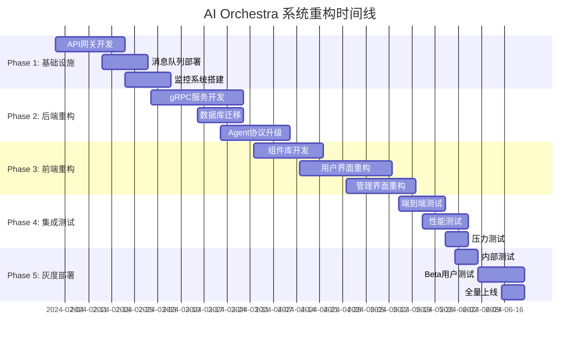

# AI Orchestra - 系统重构设计文档

## 概述

本文档详细设计了AI Orchestra系统的全面重构方案，包括现代化通信架构、用户界面重新设计、以及完整的实施路径。重构目标是构建一个高性能、高可用、用户友好的现代化AI Agent管理平台。

---

## 第一部分：系统架构重构

### 1. 现有问题分析

#### 1.1 技术债务

- **通信协议老旧**: WebSocket + HTTP/1.1，缺乏现代化优化
- **架构耦合度高**: 单体应用，扩展性有限
- **性能瓶颈**: 连接管理复杂，缺乏智能负载均衡
- **监控不足**: 缺乏分布式追踪和全面监控

#### 1.2 用户体验问题

- **界面复杂**: 管理功能与用户功能混合
- **交互不一致**: 缺乏统一的设计语言
- **响应性差**: 实时状态更新机制有限
- **移动端支持**: 响应式设计不够完善

### 2. 重构目标

#### 2.1 技术目标

- **性能提升**: 延迟降低50%+，吞吐量提升10倍
- **可扩展性**: 支持10K并发连接，水平扩展能力
- **可靠性**: 99.9%+ 服务可用性
- **可维护性**: 模块化架构，独立开发部署

#### 2.2 用户体验目标

- **简洁直观**: 清晰的信息层次和操作流程
- **响应迅速**: <100ms交互响应，<500ms数据加载
- **功能分离**: 普通用户与管理员界面分离
- **移动友好**: 全响应式设计

---

## 第二部分：现代化通信架构

### 1. 架构概览

#### 1.1 分层架构设计

```
┌─────────────────┐
│  Client Layer   │  React SPA + HTTP/3 + SSE
├─────────────────┤
│  Gateway Layer  │  Go API Gateway + Load Balancer
├─────────────────┤
│  Service Layer  │  gRPC Microservices + Message Queue
├─────────────────┤
│  Agent Layer    │  Python/Node.js + gRPC Streams
└─────────────────┘
```

#### 1.2 通信协议选择

**Web Client ↔ Gateway**:

- **HTTP/3 RESTful API**: CRUD操作、配置管理
- **Server-Sent Events (SSE)**: 实时状态推送
- **HTTP Streaming**: 大数据流式传输

**Gateway ↔ Services**:

- **gRPC**: 服务间高性能通信
- **NATS JetStream**: 异步消息队列

**Services ↔ Agents**:

- **gRPC Bidirectional Streams**: Agent通信和任务分发

### 2. 客户端通信层设计

#### 2.1 统一API客户端

```typescript
interface ModernApiClient {
  // HTTP/3 RESTful API
  readonly rest: RestApiClient
  // 实时通信 (替代WebSocket)
  readonly realtime: RealtimeClient
  // 流式传输
  readonly stream: StreamApiClient
}

// HTTP/3 API客户端
class RestApiClient {
  private readonly httpClient: Http3Client

  async request<T>(config: RequestConfig): Promise<ApiResponse<T>> {
    return this.httpClient.request({
      ...config,
      timeout: config.timeout ?? 10000,
      retries: config.retries ?? 3,
      backoff: 'exponential'
    })
  }

  // 自动JWT token管理
  private async ensureAuthToken(config: RequestConfig) {
    if (!this.isTokenValid()) {
      await this.refreshToken()
    }
    return this.addAuthHeader(config)
  }
}

// Server-Sent Events客户端 (替代WebSocket)
class RealtimeClient {
  private eventSource: EventSource
  private subscriptions = new Map<string, Set<EventHandler>>()

  connect() {
    this.eventSource = new EventSource('/api/events/stream', {
      withCredentials: true
    })

    this.eventSource.onmessage = event => {
      const { type, data } = JSON.parse(event.data)
      this.dispatchEvent(type, data)
    }

    // SSE自动重连，比WebSocket更可靠
    this.eventSource.onerror = () => {
      console.log('连接中断，自动重连中...')
    }
  }

  subscribe<T>(eventType: string, handler: EventHandler<T>) {
    if (!this.subscriptions.has(eventType)) {
      this.subscriptions.set(eventType, new Set())
    }
    this.subscriptions.get(eventType)!.add(handler)

    // 通知服务器订阅
    return this.rest.post('/api/events/subscribe', { eventType })
  }
}
```

#### 2.2 状态管理整合

```typescript
// 与现代化API整合的状态管理
interface ModernAppState {
  // 连接状态
  connection: {
    status: 'connected' | 'connecting' | 'disconnected'
    latency: number
    retryCount: number
  }

  // 实时数据
  realtime: {
    agents: Agent[]
    tasks: Task[]
    metrics: SystemMetrics
  }

  // 用户状态
  user: {
    profile: UserProfile
    preferences: UserPreferences
    permissions: Permission[]
  }
}

// Zustand store with modern API integration
const useModernStore = create<ModernAppState>((set, get) => ({
  // ... state definition

  // 初始化连接
  async initialize() {
    const client = new ModernApiClient()

    // 建立实时连接
    await client.realtime.connect()

    // 订阅关键事件
    client.realtime.subscribe('agent.status.changed', data => {
      set(state => ({
        realtime: {
          ...state.realtime,
          agents: updateAgentStatus(state.realtime.agents, data)
        }
      }))
    })

    client.realtime.subscribe('task.progress', data => {
      set(state => ({
        realtime: {
          ...state.realtime,
          tasks: updateTaskProgress(state.realtime.tasks, data)
        }
      }))
    })
  }
}))
```

### 3. 网关层设计

#### 3.1 高性能API网关

```go
// Go实现的高性能网关
type ModernGateway struct {
    router       *gin.Engine
    serviceRegistry ServiceRegistry
    loadBalancer LoadBalancer
    rateLimiter  RateLimiter
    metrics      MetricsCollector
    cache        Cache
}

func (g *ModernGateway) Start() error {
    // HTTP/3支持
    g.router.Use(http3Middleware())

    // SSE事件流
    g.router.GET("/api/events/stream", g.handleSSEStream)

    // RESTful API代理
    g.router.Any("/api/*path", g.proxyToBackend)

    // 健康检查
    g.router.GET("/health", g.healthCheck)

    return g.router.RunTLS(":8443", "cert.pem", "key.pem")
}

func (g *ModernGateway) handleSSEStream(c *gin.Context) {
    // 设置SSE响应头
    c.Header("Content-Type", "text/event-stream")
    c.Header("Cache-Control", "no-cache")
    c.Header("Connection", "keep-alive")

    // 用户认证
    userID := g.authenticateUser(c)
    if userID == "" {
        c.AbortWithStatus(401)
        return
    }

    // 创建SSE连接
    sseConn := NewSSEConnection(c.Writer, userID)
    g.eventBus.AddConnection(userID, sseConn)

    defer g.eventBus.RemoveConnection(userID, sseConn)

    // 保持连接
    <-c.Request.Context().Done()
}

func (g *ModernGateway) proxyToBackend(c *gin.Context) {
    // 智能路由
    service := g.extractServiceName(c.Request.URL.Path)
    backend := g.loadBalancer.SelectBackend(service, c.Request)

    // 请求转发
    proxy := httputil.NewSingleHostReverseProxy(backend.URL)
    proxy.ModifyResponse = g.modifyResponse
    proxy.ServeHTTP(c.Writer, c.Request)

    // 指标收集
    g.metrics.RecordRequest(service, c.Request.Method, c.Writer.Status())
}
```

#### 3.2 智能负载均衡

```go
type SmartLoadBalancer struct {
    backends []Backend
    strategy BalancingStrategy
    healthChecker HealthChecker
}

func (lb *SmartLoadBalancer) SelectBackend(service string, request *http.Request) *Backend {
    healthyBackends := lb.getHealthyBackends(service)

    switch lb.strategy {
    case LatencyBased:
        return lb.selectByLatency(healthyBackends)
    case ResourceBased:
        return lb.selectByResourceUsage(healthyBackends)
    case ConsistentHash:
        return lb.selectByHash(healthyBackends, request.Header.Get("User-ID"))
    default:
        return lb.selectRoundRobin(healthyBackends)
    }
}

func (lb *SmartLoadBalancer) selectByLatency(backends []Backend) *Backend {
    if len(backends) == 0 {
        return nil
    }

    bestBackend := backends[0]
    bestLatency := bestBackend.Metrics.AverageLatency

    for _, backend := range backends[1:] {
        if backend.Metrics.AverageLatency < bestLatency {
            bestLatency = backend.Metrics.AverageLatency
            bestBackend = backend
        }
    }

    return &bestBackend
}
```

### 4. 微服务层设计

#### 4.1 gRPC服务定义

```protobuf
// modern_agent_service.proto
syntax = "proto3";

package ai_orchestra.v2;

service ModernAgentService {
  // Agent管理
  rpc RegisterAgent(RegisterAgentRequest) returns (RegisterAgentResponse);
  rpc StreamHeartbeat(stream HeartbeatMessage) returns (stream HeartbeatResponse);

  // 任务管理
  rpc AssignTask(AssignTaskRequest) returns (stream TaskEvent);
  rpc TaskBidirectionalStream(stream TaskMessage) returns (stream TaskMessage);

  // 状态查询
  rpc ListAgents(ListAgentsRequest) returns (stream Agent);
  rpc GetRealTimeMetrics(MetricsRequest) returns (stream MetricsSnapshot);
}

message Agent {
  string id = 1;
  string name = 2;
  repeated string capabilities = 3;
  AgentStatus status = 4;
  google.protobuf.Timestamp last_heartbeat = 5;
  ResourceMetrics resources = 6;
  PerformanceMetrics performance = 7;
}

message ResourceMetrics {
  double cpu_usage = 1;
  double memory_usage = 2;
  double disk_usage = 3;
  int64 network_bytes_in = 4;
  int64 network_bytes_out = 5;
}

message TaskMessage {
  string task_id = 1;
  string agent_id = 2;
  TaskType type = 3;
  google.protobuf.Any payload = 4;
  TaskPriority priority = 5;
  google.protobuf.Timestamp timestamp = 6;
}

enum TaskPriority {
  TASK_PRIORITY_LOW = 0;
  TASK_PRIORITY_NORMAL = 1;
  TASK_PRIORITY_HIGH = 2;
  TASK_PRIORITY_CRITICAL = 3;
}
```

#### 4.2 消息队列集成

```go
// NATS JetStream消息系统
type ModernMessageBus struct {
    nc *nats.Conn
    js nats.JetStreamContext
}

func NewModernMessageBus(servers string) (*ModernMessageBus, error) {
    nc, err := nats.Connect(servers, nats.ReconnectWait(5*time.Second))
    if err != nil {
        return nil, err
    }

    js, err := nc.JetStream()
    if err != nil {
        return nil, err
    }

    // 创建持久化流
    streams := map[string][]string{
        "TASKS":   {"tasks.>"},
        "EVENTS":  {"events.>"},
        "METRICS": {"metrics.>"},
        "LOGS":    {"logs.>"},
    }

    for name, subjects := range streams {
        _, err := js.AddStream(&nats.StreamConfig{
            Name:     name,
            Subjects: subjects,
            Storage:  nats.FileStorage,
            Retention: nats.WorkQueuePolicy,
            MaxAge:   24 * time.Hour,
            Replicas: 3, // 高可用
        })
        if err != nil && !strings.Contains(err.Error(), "already exists") {
            return nil, err
        }
    }

    return &ModernMessageBus{nc: nc, js: js}, nil
}

func (mb *ModernMessageBus) PublishTaskWithPriority(
    agentID string,
    task *Task,
    priority TaskPriority,
) error {
    data, err := proto.Marshal(task)
    if err != nil {
        return err
    }

    subject := fmt.Sprintf("tasks.%s.%s", priority, agentID)

    _, err = mb.js.Publish(subject, data,
        nats.MsgId(task.ID),
        nats.ExpectStream("TASKS"),
    )

    return err
}
```

---

## 第三部分：用户界面重构

### 1. 设计系统

#### 1.1 视觉系统

```css
/* 现代化设计系统 */
:root {
  /* 色彩系统 */
  --primary-50: #f0f9ff;
  --primary-500: #0ea5e9;
  --primary-900: #0c4a6e;

  --secondary-50: #fdf4ff;
  --secondary-500: #a855f7;
  --secondary-900: #581c87;

  --success-500: #10b981;
  --warning-500: #f59e0b;
  --error-500: #ef4444;

  /* 间距系统 */
  --space-1: 0.25rem;
  --space-2: 0.5rem;
  --space-4: 1rem;
  --space-8: 2rem;

  /* 字体系统 */
  --font-display: 'Inter', system-ui, sans-serif;
  --font-mono: 'JetBrains Mono', monospace;

  /* 阴影系统 */
  --shadow-sm: 0 1px 2px 0 rgb(0 0 0 / 0.05);
  --shadow-lg: 0 10px 15px -3px rgb(0 0 0 / 0.1);

  /* 动画系统 */
  --transition-fast: 150ms ease-out;
  --transition-smooth: 300ms ease-in-out;
}
```

#### 1.2 组件系统

```typescript
// 现代化组件库
export interface ComponentProps {
  className?: string
  children?: React.ReactNode
  variant?: 'primary' | 'secondary' | 'ghost' | 'outline'
  size?: 'sm' | 'md' | 'lg'
}

// 统一按钮组件
export const Button: React.FC<ComponentProps & {
  loading?: boolean
  icon?: React.ReactNode
  onClick?: () => void | Promise<void>
}> = ({ children, variant = 'primary', size = 'md', loading, icon, onClick, ...props }) => {
  const [isLoading, setIsLoading] = useState(false)

  const handleClick = async () => {
    if (!onClick) return

    setIsLoading(true)
    try {
      await onClick()
    } finally {
      setIsLoading(false)
    }
  }

  return (
    <button
      className={cn(
        'inline-flex items-center justify-center gap-2 rounded-lg font-medium transition-all',
        'focus-visible:ring-2 focus-visible:ring-primary-500 focus-visible:outline-none',
        'disabled:opacity-50 disabled:cursor-not-allowed',
        {
          'bg-primary-500 text-white hover:bg-primary-600': variant === 'primary',
          'bg-secondary-100 text-secondary-900 hover:bg-secondary-200': variant === 'secondary',
          'border border-gray-300 bg-white hover:bg-gray-50': variant === 'outline',
          'hover:bg-gray-100': variant === 'ghost',
        },
        {
          'px-3 py-1.5 text-sm': size === 'sm',
          'px-4 py-2 text-sm': size === 'md',
          'px-6 py-3 text-base': size === 'lg',
        },
        props.className
      )}
      disabled={loading || isLoading}
      onClick={handleClick}
      {...props}
    >
      {(loading || isLoading) && <Spinner className="w-4 h-4" />}
      {icon && <span className="w-4 h-4">{icon}</span>}
      {children}
    </button>
  )
}
```

### 2. 页面架构重构

#### 2.1 用户首页设计

```typescript
// 现代化用户首页
export function ModernUserHomePage() {
  const { user } = useAuth()
  const { agents, sessions, metrics } = useRealtime()
  const navigate = useNavigate()

  return (
    <div className="min-h-screen bg-gradient-to-br from-gray-50 via-white to-gray-50">
      {/* 现代化头部 */}
      <header className="backdrop-blur-xl bg-white/80 border-b border-gray-200/50 sticky top-0 z-50">
        <div className="max-w-7xl mx-auto px-6 py-4">
          <div className="flex items-center justify-between">
            <div className="flex items-center gap-4">
              <div className="flex items-center gap-3">
                <div className="w-8 h-8 rounded-xl bg-gradient-to-r from-primary-500 to-secondary-500 flex items-center justify-center">
                  <Sparkles className="w-4 h-4 text-white" />
                </div>
                <h1 className="text-xl font-bold bg-gradient-to-r from-primary-600 to-secondary-600 bg-clip-text text-transparent">
                  AI Orchestra
                </h1>
              </div>
            </div>

            <div className="flex items-center gap-3">
              <Button variant="ghost" size="sm" onClick={() => navigate('/settings')}>
                <Settings className="w-4 h-4" />
                设置
              </Button>

              <UserProfileDropdown user={user} />
            </div>
          </div>
        </div>
      </header>

      <main className="max-w-7xl mx-auto px-6 py-8">
        {/* 欢迎区域 */}
        <div className="mb-8">
          <h2 className="text-3xl font-bold text-gray-900 mb-2">
            欢迎回来，{user?.displayName || user?.username}
          </h2>
          <p className="text-gray-600">
            开始新的AI对话，或继续之前的会话
          </p>
        </div>

        {/* 快速操作 */}
        <div className="grid grid-cols-1 md:grid-cols-3 gap-6 mb-8">
          <QuickActionCard
            icon={<Plus className="w-6 h-6" />}
            title="新建会话"
            description="开始与AI的新对话"
            onClick={() => handleCreateSession()}
            variant="primary"
          />

          <QuickActionCard
            icon={<Bot className="w-6 h-6" />}
            title="AI配置"
            description="管理AI模型和API密钥"
            onClick={() => navigate('/settings?tab=ai')}
            variant="secondary"
          />

          <QuickActionCard
            icon={<BarChart3 className="w-6 h-6" />}
            title="使用统计"
            description="查看对话和使用情况"
            onClick={() => navigate('/analytics')}
            variant="accent"
          />
        </div>

        {/* 主要内容区域 */}
        <div className="grid grid-cols-1 lg:grid-cols-3 gap-8">
          {/* 最近会话 */}
          <div className="lg:col-span-2">
            <RecentSessionsList
              sessions={sessions}
              onSessionClick={(id) => navigate(`/chat/${id}`)}
            />
          </div>

          {/* 系统状态侧边栏 */}
          <div className="space-y-6">
            <SystemStatusCard agents={agents} />
            <UsageStatsCard metrics={metrics} />
          </div>
        </div>
      </main>
    </div>
  )
}

// 快速操作卡片组件
function QuickActionCard({ icon, title, description, onClick, variant }) {
  const variantStyles = {
    primary: 'border-primary-200 bg-gradient-to-br from-primary-50 to-primary-100 hover:from-primary-100 hover:to-primary-200',
    secondary: 'border-secondary-200 bg-gradient-to-br from-secondary-50 to-secondary-100 hover:from-secondary-100 hover:to-secondary-200',
    accent: 'border-emerald-200 bg-gradient-to-br from-emerald-50 to-emerald-100 hover:from-emerald-100 hover:to-emerald-200'
  }

  return (
    <div
      className={cn(
        'group cursor-pointer rounded-2xl border-2 p-6 transition-all duration-300',
        'hover:shadow-lg hover:shadow-current/10 hover:scale-[1.02]',
        variantStyles[variant]
      )}
      onClick={onClick}
    >
      <div className="flex flex-col items-center text-center space-y-4">
        <div className={cn(
          'w-12 h-12 rounded-xl flex items-center justify-center transition-transform group-hover:scale-110',
          {
            'bg-primary-500 text-white': variant === 'primary',
            'bg-secondary-500 text-white': variant === 'secondary',
            'bg-emerald-500 text-white': variant === 'accent',
          }
        )}>
          {icon}
        </div>
        <div>
          <h3 className="font-semibold text-gray-900 mb-2">{title}</h3>
          <p className="text-sm text-gray-600">{description}</p>
        </div>
      </div>
    </div>
  )
}
```

#### 2.2 管理员仪表板

```typescript
// 现代化管理员仪表板
export function ModernAdminDashboard() {
  const [activeTab, setActiveTab] = useState<AdminTab>('overview')
  const { systemMetrics, userStats, agentStatus } = useAdminData()

  return (
    <div className="min-h-screen bg-gray-50">
      <AdminHeader />

      <main className="max-w-7xl mx-auto px-6 py-8">
        {/* 标签导航 */}
        <Tabs value={activeTab} onValueChange={setActiveTab} className="space-y-8">
          <TabsList className="grid w-full grid-cols-5 bg-white rounded-xl border border-gray-200 p-1">
            {adminTabs.map((tab) => (
              <TabsTrigger
                key={tab.value}
                value={tab.value}
                className="flex items-center gap-2 data-[state=active]:bg-primary-500 data-[state=active]:text-white"
              >
                <tab.icon className="w-4 h-4" />
                {tab.label}
              </TabsTrigger>
            ))}
          </TabsList>

          {/* 系统概览 */}
          <TabsContent value="overview" className="space-y-8">
            {/* KPI指标卡片 */}
            <div className="grid grid-cols-1 md:grid-cols-2 lg:grid-cols-4 gap-6">
              <MetricCard
                title="总用户数"
                value={userStats.total.toLocaleString()}
                change={`+${userStats.growth}%`}
                trend="up"
                icon={<Users className="w-5 h-5" />}
                color="blue"
              />

              <MetricCard
                title="活跃Agent"
                value={`${agentStatus.online}/${agentStatus.total}`}
                subtitle="运行正常"
                icon={<Bot className="w-5 h-5" />}
                color="green"
              />

              <MetricCard
                title="今日对话"
                value={systemMetrics.dailyConversations.toLocaleString()}
                change={`+${systemMetrics.conversationGrowth}%`}
                trend="up"
                icon={<MessageSquare className="w-5 h-5" />}
                color="purple"
              />

              <MetricCard
                title="系统状态"
                value={`${systemMetrics.uptime}%`}
                subtitle="运行时间"
                icon={<Activity className="w-5 h-5" />}
                color="orange"
              />
            </div>

            {/* 详细监控面板 */}
            <div className="grid grid-cols-1 lg:grid-cols-2 gap-8">
              <SystemResourceMonitor metrics={systemMetrics} />
              <AlertsPanel alerts={systemMetrics.alerts} />
            </div>

            {/* 实时活动图表 */}
            <RealtimeActivityChart data={systemMetrics.activityData} />
          </TabsContent>

          {/* 其他标签内容 */}
          <TabsContent value="users">
            <UserManagementPanel />
          </TabsContent>

          <TabsContent value="system">
            <SystemMonitoringPanel />
          </TabsContent>

          <TabsContent value="logs">
            <LogsAuditPanel />
          </TabsContent>

          <TabsContent value="settings">
            <SystemSettingsPanel />
          </TabsContent>
        </Tabs>
      </main>
    </div>
  )
}
```

#### 2.3 用户设置页面

```typescript
// 现代化用户设置页面
export function ModernUserSettings() {
  const [activeTab, setActiveTab] = useState<SettingsTab>('profile')
  const { user, updateProfile } = useAuth()
  const [loading, setLoading] = useState(false)

  return (
    <div className="min-h-screen bg-gray-50">
      <SettingsHeader />

      <main className="max-w-4xl mx-auto px-6 py-8">
        <Tabs value={activeTab} onValueChange={setActiveTab} className="space-y-8">
          <TabsList className="grid w-full grid-cols-4 bg-white rounded-xl border border-gray-200">
            {settingsTabs.map((tab) => (
              <TabsTrigger key={tab.value} value={tab.value}>
                <tab.icon className="w-4 h-4 mr-2" />
                {tab.label}
              </TabsTrigger>
            ))}
          </TabsList>

          {/* 个人资料 */}
          <TabsContent value="profile">
            <Card className="border-0 shadow-lg">
              <CardHeader className="pb-6">
                <CardTitle className="flex items-center gap-2 text-xl">
                  <User className="w-5 h-5 text-primary-500" />
                  个人信息
                </CardTitle>
              </CardHeader>

              <CardContent className="space-y-6">
                {/* 头像上传 */}
                <div className="flex items-start gap-6">
                  <div className="relative">
                    <Avatar className="w-24 h-24">
                      <AvatarImage src={user?.avatar} />
                      <AvatarFallback className="text-2xl bg-gradient-to-br from-primary-500 to-secondary-500 text-white">
                        {user?.username?.charAt(0).toUpperCase()}
                      </AvatarFallback>
                    </Avatar>

                    <Button
                      variant="outline"
                      size="sm"
                      className="absolute -bottom-2 -right-2 rounded-full w-8 h-8 p-0"
                    >
                      <Camera className="w-3 h-3" />
                    </Button>
                  </div>

                  <div className="flex-1 space-y-2">
                    <h3 className="font-medium text-gray-900">个人头像</h3>
                    <p className="text-sm text-gray-600 mb-3">
                      支持 JPG、PNG 格式，建议尺寸 200x200px
                    </p>
                    <div className="flex gap-2">
                      <Button variant="outline" size="sm">
                        <Upload className="w-4 h-4 mr-1" />
                        上传头像
                      </Button>
                      <Button variant="ghost" size="sm">
                        <Trash2 className="w-4 h-4 mr-1" />
                        删除
                      </Button>
                    </div>
                  </div>
                </div>

                {/* 个人信息表单 */}
                <ProfileForm user={user} onSave={updateProfile} loading={loading} />
              </CardContent>
            </Card>
          </TabsContent>

          {/* AI配置 */}
          <TabsContent value="ai">
            <div className="space-y-6">
              <AiConfigurationPanel />
              <DefaultModelSettings />
            </div>
          </TabsContent>

          {/* 安全设置 */}
          <TabsContent value="security">
            <div className="space-y-6">
              <PasswordChangeCard />
              <SecurityOptionsCard />
              <SessionManagementCard />
            </div>
          </TabsContent>

          {/* 通知设置 */}
          <TabsContent value="notifications">
            <NotificationPreferencesCard />
          </TabsContent>
        </Tabs>
      </main>
    </div>
  )
}
```

### 3. 响应式设计

#### 3.1 移动端适配

```css
/* 移动端优先的响应式设计 */
.responsive-container {
  @apply px-4 sm:px-6 lg:px-8;
}

.responsive-grid {
  @apply grid gap-4 grid-cols-1 sm:grid-cols-2 lg:grid-cols-3 xl:grid-cols-4;
}

.responsive-card {
  @apply p-4 sm:p-6 lg:p-8;
}

/* 移动端导航 */
@media (max-width: 768px) {
  .desktop-nav {
    @apply hidden;
  }

  .mobile-nav {
    @apply block fixed bottom-0 left-0 right-0 bg-white border-t border-gray-200 z-50;
  }

  .mobile-tab-bar {
    @apply flex items-center justify-around py-2;
  }

  .mobile-tab-item {
    @apply flex flex-col items-center gap-1 p-2 rounded-lg transition-colors;
  }
}
```

#### 3.2 触摸友好交互

```typescript
// 移动端优化的交互组件
export function MobileOptimizedButton({ children, ...props }) {
  return (
    <button
      className={cn(
        'min-h-[44px] min-w-[44px]', // iOS推荐的最小触摸尺寸
        'active:scale-95 transition-transform', // 触摸反馈
        'touch-manipulation', // 优化触摸响应
        props.className
      )}
      {...props}
    >
      {children}
    </button>
  )
}

// 滑动手势支持
export function SwipeableCard({ onSwipeLeft, onSwipeRight, children }) {
  const [startX, setStartX] = useState(0)
  const [currentX, setCurrentX] = useState(0)

  const handleTouchStart = (e) => {
    setStartX(e.touches[0].clientX)
  }

  const handleTouchMove = (e) => {
    setCurrentX(e.touches[0].clientX)
  }

  const handleTouchEnd = () => {
    const diffX = startX - currentX
    const threshold = 100

    if (Math.abs(diffX) > threshold) {
      if (diffX > 0) {
        onSwipeLeft?.()
      } else {
        onSwipeRight?.()
      }
    }

    setStartX(0)
    setCurrentX(0)
  }

  return (
    <div
      onTouchStart={handleTouchStart}
      onTouchMove={handleTouchMove}
      onTouchEnd={handleTouchEnd}
      className="touch-pan-x"
    >
      {children}
    </div>
  )
}
```

---

## 第四部分：实时数据集成

### 1. 现代化状态管理

#### 1.1 实时数据同步

```typescript
// 基于SSE的实时数据同步
class RealtimeDataSync {
  private eventSource: EventSource | null = null
  private subscriptions = new Map<string, Set<DataHandler>>()
  private reconnectAttempts = 0
  private maxReconnectAttempts = 5

  async connect(authToken: string) {
    if (this.eventSource?.readyState === EventSource.OPEN) {
      return
    }

    this.eventSource = new EventSource(`/api/realtime/stream?token=${authToken}`)

    this.eventSource.onopen = () => {
      console.log('🔗 实时数据连接已建立')
      this.reconnectAttempts = 0
    }

    this.eventSource.onmessage = event => {
      try {
        const { type, data, timestamp } = JSON.parse(event.data)
        this.handleRealtimeData(type, data, timestamp)
      } catch (error) {
        console.error('Failed to parse realtime data:', error)
      }
    }

    this.eventSource.onerror = () => {
      console.warn('⚠️ 实时连接中断，尝试重连...')
      this.handleConnectionError()
    }
  }

  subscribe<T>(dataType: string, handler: DataHandler<T>): () => void {
    if (!this.subscriptions.has(dataType)) {
      this.subscriptions.set(dataType, new Set())
    }

    this.subscriptions.get(dataType)!.add(handler)

    // 返回取消订阅函数
    return () => {
      this.subscriptions.get(dataType)?.delete(handler)
    }
  }

  private handleRealtimeData(type: string, data: any, timestamp: string) {
    const handlers = this.subscriptions.get(type)
    if (!handlers) return

    const parsedData = {
      ...data,
      timestamp: new Date(timestamp),
      received: new Date()
    }

    handlers.forEach(handler => {
      try {
        handler(parsedData)
      } catch (error) {
        console.error(`Error in realtime handler for ${type}:`, error)
      }
    })
  }
}

// 与Zustand集成
const useRealtimeStore = create<RealtimeState>((set, get) => ({
  // 连接状态
  connected: false,
  lastUpdate: null,

  // 实时数据
  agents: [],
  tasks: [],
  metrics: null,

  // 同步管理器
  syncManager: new RealtimeDataSync(),

  // 初始化实时连接
  async initialize() {
    const { syncManager } = get()
    const authToken = getAuthToken()

    if (!authToken) {
      throw new Error('Authentication required for realtime connection')
    }

    await syncManager.connect(authToken)

    // 订阅Agent状态变化
    syncManager.subscribe('agent.status', data => {
      set(state => ({
        agents: updateAgentInList(state.agents, data),
        lastUpdate: new Date()
      }))
    })

    // 订阅任务进度更新
    syncManager.subscribe('task.progress', data => {
      set(state => ({
        tasks: updateTaskProgress(state.tasks, data),
        lastUpdate: new Date()
      }))
    })

    // 订阅系统指标
    syncManager.subscribe('system.metrics', data => {
      set({ metrics: data, lastUpdate: new Date() })
    })

    set({ connected: true })
  }
}))
```

#### 1.2 智能缓存策略

```typescript
// 多层缓存系统
class SmartCacheManager {
  private memoryCache = new Map<string, CacheEntry>()
  private indexedDBCache: IDBPDatabase | null = null
  private cacheConfig = {
    memory: {
      maxSize: 100, // 最大条目数
      ttl: 5 * 60 * 1000 // 5分钟
    },
    indexedDB: {
      ttl: 24 * 60 * 60 * 1000 // 24小时
    }
  }

  async initialize() {
    // 初始化IndexedDB
    this.indexedDBCache = await openDB('ai-orchestra-cache', 1, {
      upgrade(db) {
        db.createObjectStore('api-cache', { keyPath: 'key' })
        db.createObjectStore('user-data', { keyPath: 'key' })
      }
    })
  }

  async get<T>(key: string): Promise<T | null> {
    // 首先检查内存缓存
    const memoryEntry = this.memoryCache.get(key)
    if (memoryEntry && !this.isExpired(memoryEntry)) {
      return memoryEntry.data
    }

    // 检查IndexedDB缓存
    if (this.indexedDBCache) {
      const dbEntry = await this.indexedDBCache.get('api-cache', key)
      if (dbEntry && !this.isExpired(dbEntry)) {
        // 同步到内存缓存
        this.setMemoryCache(key, dbEntry.data, dbEntry.expires)
        return dbEntry.data
      }
    }

    return null
  }

  async set<T>(key: string, data: T, options: CacheOptions = {}) {
    const expires = Date.now() + (options.ttl ?? this.cacheConfig.memory.ttl)

    // 设置内存缓存
    this.setMemoryCache(key, data, expires)

    // 设置IndexedDB缓存（用于持久化）
    if (this.indexedDBCache && options.persistent !== false) {
      await this.indexedDBCache.put('api-cache', {
        key,
        data,
        expires: Date.now() + this.cacheConfig.indexedDB.ttl,
        created: Date.now()
      })
    }
  }

  private setMemoryCache<T>(key: string, data: T, expires: number) {
    // LRU清理
    if (this.memoryCache.size >= this.cacheConfig.memory.maxSize) {
      const oldestKey = this.memoryCache.keys().next().value
      this.memoryCache.delete(oldestKey)
    }

    this.memoryCache.set(key, { data, expires, created: Date.now() })
  }

  // 预测性缓存预加载
  async prefetch(keys: string[]) {
    const promises = keys.map(async key => {
      if (!this.memoryCache.has(key)) {
        // 后台加载数据
        try {
          const data = await this.loadFromAPI(key)
          await this.set(key, data)
        } catch (error) {
          console.warn(`Failed to prefetch ${key}:`, error)
        }
      }
    })

    await Promise.allSettled(promises)
  }
}
```

---

## 第五部分：部署和运维

### 1. 容器化部署

#### 1.1 多阶段Docker构建

```dockerfile
# 前端构建
FROM node:18-alpine AS web-builder
WORKDIR /app
COPY packages/web/package*.json ./
RUN npm ci --only=production
COPY packages/web/ ./
RUN npm run build

# 网关构建
FROM golang:1.21-alpine AS gateway-builder
WORKDIR /app
COPY packages/gateway/go.mod packages/gateway/go.sum ./
RUN go mod download
COPY packages/gateway/ ./
RUN CGO_ENABLED=0 GOOS=linux go build -o gateway ./cmd/main.go

# 最终镜像
FROM nginx:alpine
COPY --from=web-builder /app/dist /usr/share/nginx/html
COPY --from=gateway-builder /app/gateway /usr/local/bin/
COPY nginx.conf /etc/nginx/nginx.conf

EXPOSE 80 443
CMD ["sh", "-c", "gateway & nginx -g 'daemon off;'"]
```

#### 1.2 Kubernetes部署清单

```yaml
# 完整的K8s部署配置
apiVersion: v1
kind: Namespace
metadata:
  name: ai-orchestra
---
apiVersion: apps/v1
kind: Deployment
metadata:
  name: ai-orchestra-app
  namespace: ai-orchestra
spec:
  replicas: 3
  strategy:
    type: RollingUpdate
    rollingUpdate:
      maxUnavailable: 1
      maxSurge: 1
  selector:
    matchLabels:
      app: ai-orchestra-app
  template:
    metadata:
      labels:
        app: ai-orchestra-app
        version: v2.0
    spec:
      containers:
        - name: app
          image: ai-orchestra/app:v2.0
          ports:
            - containerPort: 80
            - containerPort: 8080
          env:
            - name: NODE_ENV
              value: 'production'
            - name: DATABASE_URL
              valueFrom:
                secretKeyRef:
                  name: app-secrets
                  key: database-url
            - name: REDIS_URL
              value: 'redis://redis:6379'
            - name: NATS_URL
              value: 'nats://nats:4222'
          resources:
            requests:
              memory: '256Mi'
              cpu: '200m'
            limits:
              memory: '1Gi'
              cpu: '1000m'
          livenessProbe:
            httpGet:
              path: /health
              port: 8080
            initialDelaySeconds: 30
            periodSeconds: 10
          readinessProbe:
            httpGet:
              path: /ready
              port: 8080
            initialDelaySeconds: 5
            periodSeconds: 5
          volumeMounts:
            - name: config
              mountPath: /app/config
              readOnly: true
      volumes:
        - name: config
          configMap:
            name: app-config
---
apiVersion: v1
kind: Service
metadata:
  name: ai-orchestra-service
  namespace: ai-orchestra
spec:
  selector:
    app: ai-orchestra-app
  ports:
    - name: http
      port: 80
      targetPort: 80
    - name: api
      port: 8080
      targetPort: 8080
  type: LoadBalancer
---
# HPA自动扩缩容
apiVersion: autoscaling/v2
kind: HorizontalPodAutoscaler
metadata:
  name: ai-orchestra-hpa
  namespace: ai-orchestra
spec:
  scaleTargetRef:
    apiVersion: apps/v1
    kind: Deployment
    name: ai-orchestra-app
  minReplicas: 3
  maxReplicas: 20
  metrics:
    - type: Resource
      resource:
        name: cpu
        target:
          type: Utilization
          averageUtilization: 70
    - type: Resource
      resource:
        name: memory
        target:
          type: Utilization
          averageUtilization: 80
```

### 2. 监控和可观测性

#### 2.1 Prometheus + Grafana监控

```yaml
# 监控配置
apiVersion: v1
kind: ConfigMap
metadata:
  name: prometheus-config
data:
  prometheus.yml: |
    global:
      scrape_interval: 15s
      evaluation_interval: 15s

    rule_files:
      - "/etc/prometheus/rules/*.yml"

    scrape_configs:
      # AI Orchestra应用监控
      - job_name: 'ai-orchestra'
        kubernetes_sd_configs:
          - role: endpoints
            namespaces:
              names: ['ai-orchestra']
        relabel_configs:
          - source_labels: [__meta_kubernetes_service_name]
            action: keep
            regex: ai-orchestra-service

      # NATS监控
      - job_name: 'nats'
        static_configs:
          - targets: ['nats:8222']

      # 系统监控
      - job_name: 'node-exporter'
        kubernetes_sd_configs:
          - role: node
        relabel_configs:
          - source_labels: [__address__]
            regex: '(.*):10250'
            target_label: __address__
            replacement: '${1}:9100'

    alerting:
      alertmanagers:
        - static_configs:
            - targets: ['alertmanager:9093']
---
apiVersion: v1
kind: ConfigMap
metadata:
  name: grafana-dashboards
data:
  ai-orchestra-overview.json: |
    {
      "dashboard": {
        "title": "AI Orchestra System Overview",
        "panels": [
          {
            "title": "Active Users",
            "type": "stat",
            "targets": [
              {
                "expr": "ai_orchestra_active_users_total"
              }
            ]
          },
          {
            "title": "Agent Status",
            "type": "piechart", 
            "targets": [
              {
                "expr": "ai_orchestra_agents_by_status"
              }
            ]
          },
          {
            "title": "Response Time",
            "type": "graph",
            "targets": [
              {
                "expr": "histogram_quantile(0.95, ai_orchestra_request_duration_seconds_bucket)"
              }
            ]
          }
        ]
      }
    }
```

#### 2.2 结构化日志和追踪

```go
// 结构化日志配置
func setupLogging() {
    log.SetFormatter(&log.JSONFormatter{
        TimestampFormat: time.RFC3339,
        FieldMap: log.FieldMap{
            log.FieldKeyTime:  "timestamp",
            log.FieldKeyLevel: "level",
            log.FieldKeyMsg:   "message",
        },
    })

    // 添加请求ID中间件
    log.SetReportCaller(true)
}

// 分布式追踪
func setupTracing() {
    exporter, err := jaeger.New(
        jaeger.WithCollectorEndpoint(
            jaeger.WithEndpoint(os.Getenv("JAEGER_ENDPOINT")),
        ),
    )
    if err != nil {
        log.Fatal(err)
    }

    tp := tracesdk.NewTracerProvider(
        tracesdk.WithBatcher(exporter),
        tracesdk.WithResource(resource.NewWithAttributes(
            semconv.SchemaURL,
            semconv.ServiceNameKey.String("ai-orchestra-v2"),
            semconv.ServiceVersionKey.String("2.0.0"),
        )),
    )

    otel.SetTracerProvider(tp)
}
```

---

## 第六部分：实施路径

### 1. 渐进式迁移策略

#### 1.1 迁移阶段规划



#### 1.2 风险控制措施

```typescript
// 功能开关系统
interface FeatureFlag {
  key: string
  enabled: boolean
  rolloutPercentage: number
  conditions?: FeatureCondition[]
}

class FeatureFlagManager {
  private flags = new Map<string, FeatureFlag>()

  async isEnabled(key: string, context: FeatureContext): Promise<boolean> {
    const flag = this.flags.get(key)
    if (!flag) return false

    // 基础开关
    if (!flag.enabled) return false

    // 百分比控制
    if (this.getUserHash(context.userId) % 100 >= flag.rolloutPercentage) {
      return false
    }

    // 条件检查
    if (flag.conditions) {
      return flag.conditions.every(condition => this.evaluateCondition(condition, context))
    }

    return true
  }

  // 渐进式功能发布
  async enableForUsers(key: string, userIds: string[]) {
    const flag = this.flags.get(key)
    if (flag) {
      flag.conditions = [...(flag.conditions || []), { type: 'user_in_list', values: userIds }]
    }
  }
}

// 使用示例
export function useModernUI() {
  const [enabled, setEnabled] = useState(false)
  const { user } = useAuth()

  useEffect(() => {
    featureFlags.isEnabled('modern_ui_v2', { userId: user.id }).then(setEnabled)
  }, [user.id])

  return enabled
}
```

### 2. 数据迁移策略

#### 2.1 零停机迁移

```sql
-- 数据迁移脚本示例
-- Phase 1: 创建新表结构
CREATE TABLE users_v2 (
    id UUID PRIMARY KEY DEFAULT gen_random_uuid(),
    username VARCHAR(50) UNIQUE NOT NULL,
    email VARCHAR(255),
    display_name VARCHAR(100),
    avatar_url TEXT,
    status user_status_enum DEFAULT 'active',
    created_at TIMESTAMP WITH TIME ZONE DEFAULT NOW(),
    updated_at TIMESTAMP WITH TIME ZONE DEFAULT NOW(),
    -- 新字段
    preferences JSONB DEFAULT '{}',
    last_login_at TIMESTAMP WITH TIME ZONE,
    -- 保持与旧表的关联
    legacy_id INTEGER REFERENCES users(id)
);

-- Phase 2: 数据同步存储过程
CREATE OR REPLACE FUNCTION sync_user_data()
RETURNS TRIGGER AS $$
BEGIN
    -- 双写：同时更新新旧表
    IF TG_OP = 'INSERT' THEN
        INSERT INTO users_v2 (username, email, display_name, legacy_id)
        VALUES (NEW.username, NEW.email, NEW.nickname, NEW.id);
        RETURN NEW;
    END IF;

    IF TG_OP = 'UPDATE' THEN
        UPDATE users_v2 SET
            username = NEW.username,
            email = NEW.email,
            display_name = NEW.nickname,
            updated_at = NOW()
        WHERE legacy_id = NEW.id;
        RETURN NEW;
    END IF;

    RETURN NULL;
END;
$$ LANGUAGE plpgsql;

-- 创建触发器
CREATE TRIGGER sync_user_data_trigger
    AFTER INSERT OR UPDATE ON users
    FOR EACH ROW EXECUTE FUNCTION sync_user_data();
```

#### 2.2 数据一致性检查

```typescript
// 数据一致性验证工具
class DataMigrationValidator {
  async validateUserMigration(): Promise<ValidationResult> {
    const results: ValidationResult = {
      totalRecords: 0,
      migratedRecords: 0,
      inconsistencies: [],
      passed: true
    }

    // 检查记录数量
    const [legacyCount, newCount] = await Promise.all([
      this.db.query('SELECT COUNT(*) FROM users'),
      this.db.query('SELECT COUNT(*) FROM users_v2')
    ])

    results.totalRecords = legacyCount.rows[0].count
    results.migratedRecords = newCount.rows[0].count

    if (results.totalRecords !== results.migratedRecords) {
      results.inconsistencies.push({
        type: 'RECORD_COUNT_MISMATCH',
        expected: results.totalRecords,
        actual: results.migratedRecords
      })
      results.passed = false
    }

    // 抽样数据完整性检查
    const sampleUsers = await this.db.query(`
      SELECT u.id, u.username, u.email, u.nickname,
             v2.username as v2_username, v2.email as v2_email, v2.display_name
      FROM users u
      LEFT JOIN users_v2 v2 ON u.id = v2.legacy_id
      ORDER BY RANDOM()
      LIMIT 1000
    `)

    for (const user of sampleUsers.rows) {
      if (user.username !== user.v2_username) {
        results.inconsistencies.push({
          type: 'DATA_MISMATCH',
          recordId: user.id,
          field: 'username',
          expected: user.username,
          actual: user.v2_username
        })
        results.passed = false
      }
    }

    return results
  }
}
```

### 3. 性能测试和优化

#### 3.1 负载测试

```javascript
// K6负载测试脚本
import http from 'k6/http'
import ws from 'k6/ws'
import { check, sleep } from 'k6'

export let options = {
  stages: [
    { duration: '2m', target: 100 }, // 预热
    { duration: '5m', target: 500 }, // 正常负载
    { duration: '2m', target: 1000 }, // 峰值负载
    { duration: '3m', target: 1000 }, // 保持峰值
    { duration: '2m', target: 0 } // 降级
  ],
  thresholds: {
    http_req_duration: ['p(95)<500'], // 95%请求小于500ms
    http_req_failed: ['rate<0.1'], // 错误率小于10%
    ws_connecting: ['p(95)<1000'] // WebSocket连接时间
  }
}

export default function () {
  // 测试HTTP API
  let response = http.get('https://api.ai-orchestra.com/health')
  check(response, {
    'status is 200': r => r.status === 200,
    'response time < 200ms': r => r.timings.duration < 200
  })

  // 测试SSE连接
  const sseUrl = 'https://api.ai-orchestra.com/events/stream'
  const sseResponse = http.get(sseUrl, {
    headers: { Accept: 'text/event-stream' }
  })

  check(sseResponse, {
    'SSE connection established': r => r.status === 200,
    'content-type is event-stream': r => r.headers['Content-Type'].includes('text/event-stream')
  })

  sleep(1)
}

// WebSocket负载测试
export function wsTest() {
  const url = 'wss://api.ai-orchestra.com/ws'
  const response = ws.connect(url, null, function (socket) {
    socket.on('open', function () {
      // 发送认证消息
      socket.send(
        JSON.stringify({
          type: 'auth',
          token: 'test-token'
        })
      )

      // 订阅实时事件
      socket.send(
        JSON.stringify({
          type: 'subscribe',
          topics: ['agent.status', 'task.progress']
        })
      )
    })

    socket.on('message', function (data) {
      const message = JSON.parse(data)
      check(message, {
        'message has type': m => m.type !== undefined,
        'message has data': m => m.data !== undefined
      })
    })

    socket.setTimeout(function () {
      socket.close()
    }, 30000)
  })

  check(response, {
    'WebSocket connection successful': r => r && r.status === 101
  })
}
```

---

## 第七部分：成功指标

### 1. 技术指标

#### 1.1 性能指标

- **响应时间**: API响应时间P95 < 200ms，P99 < 500ms
- **吞吐量**: 支持10,000并发连接，处理100,000 RPS
- **可用性**: 系统可用性 > 99.9% (每月停机时间 < 43分钟)
- **错误率**: API错误率 < 0.1%，关键业务流程错误率 < 0.01%

#### 1.2 扩展性指标

- **水平扩展**: 支持通过增加节点线性扩展性能
- **存储扩展**: 支持PB级数据存储和查询
- **Agent扩展**: 支持接入10,000+ Agent实例

#### 1.3 资源效率指标

- **CPU利用率**: 平均CPU利用率保持在70%以下
- **内存使用**: 内存使用效率提升30%
- **网络带宽**: 带宽使用优化25%
- **存储成本**: 存储成本降低40%

### 2. 业务指标

#### 2.1 用户体验指标

- **页面加载时间**: 首屏加载时间 < 2秒
- **交互响应**: 用户操作响应时间 < 100ms
- **用户留存**: 月活跃用户留存率 > 80%
- **满意度**: 用户满意度评分 > 4.5/5.0

#### 2.2 功能使用指标

- **功能覆盖**: 新功能使用率 > 60%
- **任务成功率**: AI任务执行成功率 > 95%
- **会话活跃**: 平均会话时长增长20%
- **错误恢复**: 用户问题自助解决率 > 70%

### 3. 运维指标

#### 3.1 部署效率

- **部署频率**: 支持每日多次发布
- **部署时间**: 单次部署时间 < 5分钟
- **回滚时间**: 问题回滚时间 < 2分钟
- **自动化率**: 部署和运维自动化率 > 90%

#### 3.2 监控告警

- **覆盖率**: 关键指标监控覆盖率 100%
- **响应时间**: 告警响应时间 < 5分钟
- **预警准确率**: 故障预警准确率 > 85%
- **误报率**: 告警误报率 < 5%

---

## 总结

这套AI Orchestra系统重构方案提供了从通信架构到用户界面的全面现代化升级：

### 🏗️ 技术架构升级

- **现代化协议栈**: HTTP/3 + gRPC + SSE替代传统WebSocket
- **微服务架构**: 模块化、可扩展的服务设计
- **云原生部署**: Kubernetes + 服务网格 + 自动扩缩容
- **智能负载均衡**: 延迟感知、资源感知的路由策略

### 🎨 用户体验革新

- **现代化界面**: 简洁直观的设计语言
- **功能分离**: 用户界面与管理界面独立
- **响应式设计**: 移动端友好的全平台支持
- **实时交互**: 基于SSE的高效实时通信

### 📊 可观测性提升

- **全链路追踪**: 分布式请求追踪和性能分析
- **多维监控**: 业务指标 + 技术指标 + 用户行为分析
- **智能告警**: 预测性故障检测和自动恢复

### 🚀 预期收益

- **性能提升**: 50%延迟降低，10倍吞吐量提升
- **用户体验**: 更快响应，更好交互，更高满意度
- **运维效率**: 自动化部署，智能监控，快速故障恢复
- **业务价值**: 支撑更大规模用户，更复杂业务场景

这套重构方案不仅解决了当前系统的技术债务，更为AI Orchestra的未来发展奠定了坚实的技术基础。通过渐进式迁移策略，可以在保证业务连续性的前提下，安全地完成系统的全面升级。
